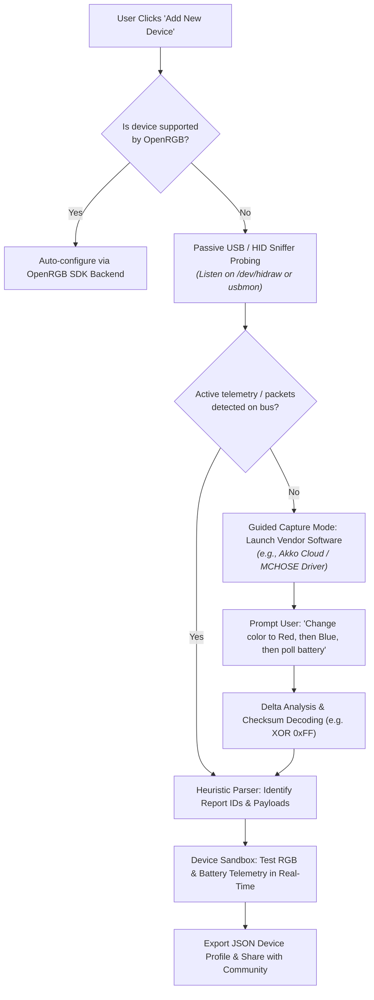

# 🔮 Future Roadmap & Long-Term Vision

This document outlines the architectural vision, technical proposals, and planned innovations to evolve **LinuxRicing** from a personal dotfile & reverse-engineering repository into a **unified hardware management platform, community-driven reverse engineering toolkit, and modular desktop ecosystem**.

---

## 🚀 1. The Unified Hardware & Assisted Reverse Engineering App

The ultimate long-term vision is to transition from standalone Python scripts and CLI helpers to a **centralized, cross-platform application (Linux + Windows)** with an intuitive GUI for device control and a revolutionary **Device Onboarding & Reverse Engineering Wizard**.

### 🛠️ Key Features of the App:
1. **Interactive "Add Device" Wizard**:
   - **Step 1 — OpenRGB Check**: Automatically queries OpenRGB device compatibility. If present, attaches seamlessly to the local SDK.
   - **Step 2 — Passive Sniffing**: Inspects raw HID and USB endpoints to check if the device broadcasts battery levels or status reports autonomously.
   - **Step 3 — Guided Vendor Capture**: If unknown, the app guides the user through capturing traffic while using the manufacturer's proprietary software (e.g. "Click Apply Color in your vendor software"). The app captures the USB/HID delta packets in the background.
   - **Step 4 — Packet Analysis & Checksum Solver**: Analyzes packet differences, helps decode opcodes, report IDs, and checksum schemes (XOR, CRC, modulo, etc.).
   - **Step 5 — Profile Export & Community Sharing**: Generates a declarative device definition file (JSON/YAML) that can be committed to the repository for everyone to benefit from.
2. **Unified Control Hub**:
   - Visual device rack displaying live battery percentages, charging indicators, connection mode (2.4 GHz, Bluetooth, USB-C), and real-time RGB preview.
   - Single-click toggle between Dynamic Wallpaper Palette (Material You), static custom colors, or dynamic effects.
3. **Cross-Platform Architecture (Linux & Windows)**:
   - Shared core engine written in Python / Rust.
   - Platform backend abstraction: `hidraw` + `ioctl` on Linux; `hidapi` on Windows.

---

## 🧩 2. Modular Desktop Ecosystem & Widget Plugins

Transform the desktop configuration from static dotfiles into a flexible, extensible plugin ecosystem:

- **Curated Dotfile Presets**: Cleanly separated Hyprland and Caelestia configs that can be applied modularly.
- **Quickshell Widget Plugin System**:
  - Independent widget modules (Google Tasks, Hardware Monitor, Spotify Player, Ambient Light Controller) that can be toggled, resized, and arranged on the desktop canvas.
  - Standardized JSON state IPC for third-party widget extensions.
- **Real-Time Synced Lyrics Overlay**:
  - Desktop canvas lyrics synchronized line-by-line with the active Spotify / media playback using LRCLIB or Spotify Web API.
  - Active line highlighting styled dynamically with Material You `m3primary` color.

### Agent Notification System — planned enhancements

The workspace-pip agent notifications (running pulse + neon halo + unseen badge)
have a few deferred pieces:

- **Off-screen workspace indicator**: the bar only paints ~5 workspace pips at a
  time (`Config.bar.workspaces.shown`). If an agent finishes on a workspace
  outside the visible group, its halo is hidden until you scroll the bar to that
  group. Add a small cue at the **bottom of the workspace container** (an arrow,
  a glow, or a mini badge) meaning "there is an unseen agent notification on a
  workspace you can't see right now" — click/scroll to reveal it.
- **General-notification halo**: extend the persistent-halo mechanism to any
  *critical* desktop notification, not just agents (cyan halo vs the green agent
  one, auto-expires after ~10 min). See
  `docs/superpowers/specs/2026-08-30-agent-running-pulse-workspace-pip-design.md` §8.
- **`arc` running-pulse style**: a rotating neon spinner around the pip, as a
  third option next to `blink` and `breathe`.
- **Per-session running count**: while agents run, the pip shows one pulse
  regardless of how many sessions are on that workspace. Optionally surface the
  count on the pip (today it only appears in the hover popout and, once finished,
  in the badge).

---

## 🌈 3. Ambient Lighting & Screen-Mirroring (Ambilight Mode)

- **Concept**: Project real-time monitor edge lighting onto the wall via the Magic Home Wi-Fi LED strip during gaming or movie playback.
- **Architecture**:
  - Lightweight capture daemon using PipeWire or `grim` sampling screen borders at low resolution (e.g. 16x9 grid).
  - Fast color averaging and low-latency TCP packet streaming (:5577) at ~20–30 FPS.
  - Quick toggle in the desktop widget or global keybind (`SUPER + ALT + A`).

---

## 💻 4. Laptop Adaptations & Power Management

- **Hardware Profile Detection**: `install.sh` and the runtime daemon detect laptop chassis:
  - **Hyprland Touchpad Gestures**: 3-finger horizontal swipe for workspace switching; 3-finger swipe up for the Caelestia application launcher.
  - **Dynamic Power Profiles**: Integration with `power-profiles-daemon` or `auto-cpufreq` to automatically drop display refresh rate to 60Hz and throttle background polling intervals when running on battery.

---

## 🎮 5. Gaming & System-Wide Theme Synchronization

- **MangoHud / Gamescope Theming**: Dynamically inject active Material You palette hex codes into `~/.config/MangoHud/MangoHud.conf` so on-screen performance overlays match the desktop aesthetic.
- **Browser & Discord Integration**: Automatically generate dynamic CSS variables (`material-you.theme.css`) for Vencord/BetterDiscord and Firefox/Brave start pages.

