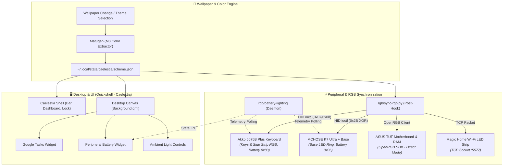

# 🌌 LinuxRicing

[](https://archlinux.org/)
[](https://hyprland.org/)
[](https://github.com/caelestia-dots/caelestia)
[](#-project-status--where-we-are)
[](LICENSE)

> A customized **Hyprland + Quickshell (Caelestia)** desktop powered by dynamic Material You theming, where **all hardware peripherals react in real-time to the active wallpaper palette** — backed by open reverse engineering documentation for wireless keyboards, mice, headsets, and ambient lighting.

---

## 🧭 Welcome

This repository contains my personal journey of modding my own Linux machine. I really like the philosophy behind [Caelestia](https://github.com/caelestia-dots/caelestia), so I wanted to give it my own personal touch by adding features I found useful. 

Here you will find every file, script, and piece of information you need to recreate this customization—and even more: I have learned how to reverse engineer and control my own peripherals, so if you happen to have the same or similar devices, you can take full advantage of my work. Feel free to look around and ask me anything!

> [!NOTE]
> The objective of this repository at this stage is **not** to be an instant, one-click installer that magically replicates my exact desktop onto your machine in seconds (maybe one day it will). The real goal is that if someone anywhere in the world is facing the exact same hardware, protocol, or ricing hurdles I went through, this repository might make their life a little bit easier.

---

## 🚧 Project Status & Where We Are

This repository is an **active, evolving work-in-progress (WIP)**. Rather than a finished, static product, it documents an ongoing journey of technical research, custom hardware drivers, UI modules, and desktop integrations.

### ✅ What is working today:
- **Dynamic Material You Theming**: Wallpaper changes trigger [Matugen](https://github.com/InioX/matugen) to generate a full Material Design 3 palette applied across Caelestia UI, terminal, and desktop widgets.
- **Peripheral RGB Synchronization (Linux)**: Custom Python drivers (`rgb/sync-rgb.py`) talking directly via `/dev/hidraw*` to sync colors across:
  - **Akko 5075B Plus Keyboard** (per-key + side diffuse strip).
  - **MCHOSE K7 Ultra Mouse 8K Charging Base** (RGB ring).
  - **Motherboard & RAM** (via OpenRGB direct mode).
  - **Magic Home Wi-Fi LED Strip** (via direct TCP socket).
- **Live Battery Telemetry & Monitoring**:
  - Background daemon (`battery-lighting`) polling wireless battery levels.
  - Desktop battery widget integration in Quickshell.
- **Custom Desktop Widgets**: Google Tasks integration, ambient light controls, and media watchers.
- **Canonical Reverse Engineering Specs**: Complete opcode, packet structure, and capture documentation in [`hardware/`](hardware/).

### 🔮 The Long-Term Vision:
- **Unified Hardware Management & Assisted Reverse Engineering App**:
  - Evolving standalone scripts into a **cross-platform application (Linux + Windows)** with an intuitive GUI device rack.
  - **Guided "Add Device" Wizard**:
    1. *OpenRGB Detection*: Automatically use OpenRGB if the hardware is already supported.
    2. *Passive Sniffer*: Auto-listen on raw HID endpoints to catch active telemetry/battery broadcasts.
    3. *Guided Vendor Capture*: Walk users through launching official manufacturer software (e.g. Akko Cloud, MCHOSE driver), sniffing USB packets on the fly, decoding opcodes/checksums, and automatically generating exportable device profiles.
- **Modular Desktop & Widget Plugins**:
  - Transitioning dotfiles into curated presets with a plug-and-play Quickshell widget architecture (e.g., real-time synced lyrics overlay, system monitors).
- **Cross-Platform Parity**: Seamless experience and RGB sync across both Linux and Window.

*(For detailed architecture diagrams and implementation specs, explore [`FUTURE_ROADMAP.md`](FUTURE_ROADMAP.md).)*

---

## 📂 Repository Structure

| Directory | Description |
|---|---|
| [`configs/`](configs/) | Dotfiles & configurations: Hyprland, Quickshell (Caelestia fork), and Spicetify theme. |
| [`widgets/`](widgets/) | Desktop widgets (`Background.qml`) and CLI helpers: `gtasks`, `mchose-battery`, `magichome-control`. |
| [`rgb/`](rgb/) | Hardware drivers, RGB sync engine (`sync-rgb.py`), battery daemon (`battery-lighting`), and test suites. |
| [`hardware/`](hardware/) | **Canonical reverse engineering knowledge base** (opcodes, packet captures, USB descriptors). |
| [`systemd/`](systemd/) | User systemd service units (`openrgb.service`, `battery-lighting.service`, etc.). |
| [`docs/`](docs/) | Architecture handover notes, runbooks, and implementation specs. |
| [`vault/`](vault/) | Obsidian vault: research notes, journey diary, and technical investigation records. |

---

## 🔌 Hardware Reverse Engineering

The single source of truth for all reverse engineered protocols is **[`hardware/README.md`](hardware/README.md)**.

| Device                                                          | Lighting Control    | Battery Telemetry          | Protocol Notes                                                                    |
| --------------------------------------------------------------- | ------------------- | -------------------------- | --------------------------------------------------------------------------------- |
| **Akko 5075B Plus Keyboard** (`3151:4015` / `3151:4011`)        | ✅ Keys + side strip | ✅ Opcode `0x83`            | Custom USB HID Feature reports (`0x07` / `0x08`). Static color sync over 2.4 GHz. |
| **MCHOSE K7 Ultra Mouse + 8K Base** (`3837:1001` / `3837:4150`) | ✅ Base LED ring     | ✅ Command `0x06`           | Payload obfuscated via `XOR 0xFF` checksum encoding.                              |
| **MCHOSE V9 Pro Headset** (`291D:385D`)                         | ❌ No RGB hardware   | ✅ 2.4 GHz (`55 65`); 🚧 BT | Battery sniffed over 2.4 GHz receiver; Bluetooth BLE parsing in progress.         |
| **ASUS TUF B560M Motherboard + A-DATA RAM**                     | ✅ Direct mode       | —                          | Synchronized via OpenRGB SDK. One-shot sync avoids I2C bus congestion.            |
| **Magic Home LED Strip** (Wi-Fi `:5577`)                        | ✅ Solid & Ambient   | —                          | Controlled via raw TCP socket / `flux_led` network protocol.                      |

---

## 🏗️ Architecture



---

## 🚀 Quick Start & Installation

```bash
# Clone the repository
git clone https://github.com/Alberviz/LinuxRicing.git
cd LinuxRicing

# Run the modular installer
./install.sh
```

`install.sh` detects your machine type (desktop workstation vs. laptop) and offers an interactive modular menu to deploy:
- Hyprland window manager configurations.
- Quickshell / Caelestia fork and desktop widgets.
- Google Tasks and CLI integrations.
- RGB peripheral synchronization scripts and systemd user units.
- Spicetify theming.

> [!IMPORTANT]
> Installed configuration files in your active system (`~/.config/`, `~/.local/bin/`) are independent **copies**, not symlinks. Whenever you make changes inside this repository, re-run `install.sh` or copy the modified file to its active destination.

---

## 🪟 Linux & The Windows Parity Goal

This machine runs a **Linux + Windows** dual-boot configuration:

- **Linux (Current Main Environment)**: Full implementation with Arch Linux, Hyprland, Quickshell, systemd user services, and low-level Linux HID (`/dev/hidraw*` via `fcntl.ioctl`).
- **Windows (Future Milestone)**: The long-term goal is to achieve visual and hardware parity on Windows:
  - Reading the active Windows desktop wallpaper color.
  - Communicating with peripherals using Windows-compatible HID APIs (`hidapi`).
  - Leveraging the exact same protocol opcodes and reverse-engineered payloads documented in [`hardware/`](hardware/).

---

## 🔗 Repository ↔ System Mapping

| Repo Path | Active System Destination | Purpose |
|---|---|---|
| `configs/quickshell/caelestia/` | `~/.config/quickshell/caelestia/` | Caelestia shell modules & UI |
| `widgets/Background.qml` | `~/.config/quickshell/caelestia/modules/background/Background.qml` | Desktop background widget |
| `rgb/sync-rgb.py` | `~/.config/caelestia/sync-rgb.py` | Wallpaper post-hook RGB synchronizer |
| `widgets/*`, `rgb/battery-lighting` | `~/.local/bin/` | CLI commands & telemetry daemons |
| `systemd/*.service` | `~/.config/systemd/user/` | Background services (OpenRGB, battery polling) |

---

## 👏 Credits & Acknowledgements

- **[Caelestia](https://github.com/caelestia-dots/caelestia)** — The elegant Quickshell desktop shell that served as the foundation for this rice (GPL-3.0; license preserved in `configs/quickshell/caelestia/LICENSE`).
- **[OpenRGB](https://openrgb.org/)** — Open-source RGB lighting control across motherboards and memory modules.
- **[Matugen](https://github.com/InioX/matugen)** — Material You palette generator from wallpaper images.
- **[flux_led](https://github.com/Danielhiversen/flux_led)** — Smart LED Wi-Fi controller protocol library.
- **Open Source Community Reverse Engineers** — Research projects such as `akko-bpf-battery` and the Linux kernel HID-BPF subsystem (6.12+) that provided inspiration for device telemetry.

---

*Original scripts, custom drivers in `rgb/`, widgets, and documentation in `hardware/` are shared freely for the community. Derived Caelestia components retain their GPL-3.0 license.*
