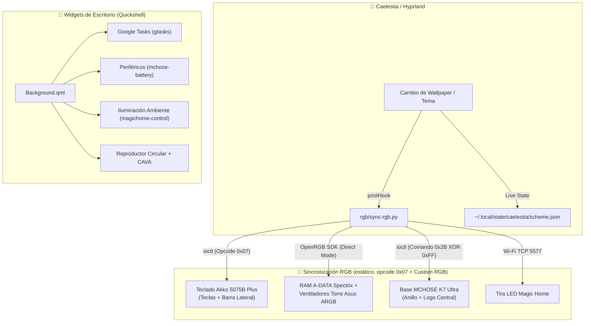

# 🌌 Linux Ricing & Hardware Ecosystem

Repositorio maestro y centralizado de personalización, widgets de escritorio, controladores de hardware propietarios y sincronización RGB dinámica para el entorno **Caelestia / Hyprland / Quickshell** con soporte Dual-Boot (Linux & Windows).

---

## 🔀 Ramas del Repositorio

| Rama | Comportamiento del RGB | Cuándo usarla |
|---|---|---|
| **`main`** | Solo color **sólido / estático**, aplicado en un único disparo (`sync-rgb.py`) al cambiar wallpaper/tema. | Uso diario por defecto. Evita saturar el bus SMBus/I2C de las RAM (ver `docs/HARDWARE_PROTOCOLS.md`, sección de precauciones). |
| **`feature/argb-wave`** | Todo lo de `main` **más** `rgb/argb-wave.py`: un daemon (`systemd/argb-wave.service`) que anima con una ola de color continua las zonas direccionables (RAM + ventiladores ARGB) a ~12.5 FPS. | Cuando quieras el efecto de ola en vez de color fijo en RAM/ventiladores. El teclado, la base MCHOSE y la tira Magic Home siguen siempre en estático. |

Para cambiar a la variante animada: `git checkout feature/argb-wave`, y activar el servicio con `systemctl --user enable --now argb-wave.service`.

---

## 🪟🐧 Qué es de Linux y qué es de Windows

Este repositorio vive en ambos sistemas del dual-boot. Cada script de sincronización RGB es **específico de un sistema operativo** — no son intercambiables porque usan APIs de HID distintas (`ioctl`/`hidraw` en Linux vs `hidapi`/gRPC en Windows):

| Archivo | Sistema | Notas |
|---|---|---|
| `rgb/sync-rgb.py` | **Solo Linux** | Lee el tema de Caelestia/Hyprland. Usa `/dev/hidraw*` vía `fcntl.ioctl`. |
| `rgb/argb-wave.py` | **Solo Linux** (rama `feature/argb-wave`) | Daemon systemd, depende del servidor OpenRGB de Linux. |
| `rgb/sync-rgb-windows.py` | **Solo Windows** | Extrae el color del wallpaper de Windows directamente. Usa `hidapi` + fallback gRPC al driver de Akko. |
| `docs/RGB_HANDOVER_WINDOWS.md`, `docs/promptWindows` | **Contexto de sesión en Windows** | Documentos de traspaso para retomar el trabajo en una sesión de Windows (Gemini/Antigravity). |
| `docs/RGB_HANDOVER_LINUX.md` | **Contexto de sesión en Linux** | Documento de traspaso equivalente al volver a Linux tras una sesión en Windows. |
| `docs/HARDWARE_PROTOCOLS.md` | **Ambos** | Especificación de protocolos de hardware, válida independientemente del SO (los opcodes y payloads HID son los mismos). |
| `widgets/`, `systemd/`, `configs/` | **Solo Linux** | Específicos de Quickshell/Caelestia/systemd de usuario. |

⚠️ **Regla al corregir un bug de hardware:** si el fix es en el protocolo/payload (como los opcodes del teclado Akko), hay que aplicarlo en **ambos** `sync-rgb.py` y `sync-rgb-windows.py` — son implementaciones paralelas del mismo protocolo, no una comparte código con la otra.

---

## 📁 Estructura del Repositorio (rama `main`)

```text
LinuxRicing/
├── README.md                      # Esta guía maestra
├── docs/                          # Documentación técnica y contextos
│   ├── CONTEXTO_WIDGETS_BACKGROUND.md # Contexto de widgets de escritorio (Background.qml)
│   ├── HARDWARE_PROTOCOLS.md      # Especificación técnica de protocolos USB HID y red (Linux + Windows)
│   ├── RGB_HANDOVER_LINUX.md      # Contexto de sesión en Linux
│   ├── RGB_HANDOVER_WINDOWS.md    # Contexto de sesión en Windows (ingeniería inversa)
│   └── promptWindows              # Prompt de traspaso para sesiones en Windows
│
├── rgb/                           # Sincronización e Iluminación RGB
│   ├── sync-rgb.py                # [Linux] Sincronizador estático (One-Shot / Caelestia Hook)
│   └── sync-rgb-windows.py        # [Windows] Sincronizador unificado
│
├── widgets/                       # [Linux] Widgets de escritorio y utilidades CLI
│   ├── Background.qml             # Componente de widgets Caelestia / Quickshell
│   ├── gtasks                     # Integración CLI / JSON con Google Tasks
│   ├── mchose-battery             # Telemetría de batería para periféricos (V9 Pro, K7 Ultra)
│   └── magichome-control          # Control CLI de tira LED Magic Home Wi-Fi
│
├── systemd/                       # [Linux] Unidades Systemd de usuario
│   ├── openrgb.service            # Servidor SDK de OpenRGB en segundo plano
│   ├── mchose-battery.service     # Servicio de polling de batería
│   └── mchose-battery.timer       # Timer programado para telemetría
│
└── configs/                       # [Linux] Archivos de configuración de Caelestia
    ├── cli.json                   # Hooks de post-cambio de tema y wallpaper
    └── shell.json                 # Configuración principal de Caelestia Shell
```

> La rama `feature/argb-wave` añade `rgb/argb-wave.py` y `systemd/argb-wave.service` a esta misma estructura.

---

## 🎨 Arquitectura del Sistema



> En `feature/argb-wave`, el bloque `RAMFANS` deja de recibir color estático de `sync-rgb.py` y pasa a ser animado en continuo por el daemon `rgb/argb-wave.py` (`argb-wave.service`), leyendo la paleta en vivo cada frame.

---

## 🚀 Comandos Rápidos

### 1. Sincronización RGB Manual
```bash
# Ejecutar sincronización manual con el tema activo
python3 ~/.config/caelestia/sync-rgb.py

# O desde el repositorio
python3 ~/LinuxRicing/rgb/sync-rgb.py
```

### 2. Gestión de Servicios Systemd
```bash
# Ver estado del servidor OpenRGB
systemctl --user status openrgb.service
```

En `feature/argb-wave` además:
```bash
# Activar / reiniciar la animación de la ola
systemctl --user enable --now argb-wave.service
systemctl --user restart argb-wave.service

# Ver logs de la ola en tiempo real
journalctl --user -u argb-wave.service -f
```

### 3. Gestión del Shell de Caelestia
```bash
# Reiniciar el entorno Quickshell / Caelestia
caelestia shell -k ; sleep 0.5 ; caelestia shell -d

# Ver logs de widgets y shell
caelestia shell -l
```

---

## 📌 Enlaces entre el Repositorio y el Sistema

Para que el sistema ejecute siempre la versión en vivo, las rutas activas en el sistema operativo (Linux) están ubicadas en:
- **Scripts RGB:** `~/.config/caelestia/sync-rgb.py` (+ `argb-wave.py` si se despliega `feature/argb-wave`)
- **Widgets QML:** `/etc/xdg/quickshell/caelestia/modules/background/Background.qml`
- **Binarios CLI:** `~/.local/bin/` (`gtasks`, `mchose-battery`, `magichome-control`)
- **Systemd:** `~/.config/systemd/user/` (`openrgb.service`, `mchose-battery.service/.timer`, + `argb-wave.service` en esa rama)

Estas rutas son **copias independientes**, no symlinks: tras fusionar un cambio hay que volver a copiar el archivo a su ruta activa (p. ej. `cp rgb/sync-rgb.py ~/.config/caelestia/sync-rgb.py`) para que el hook de Caelestia lo use.

El script de Windows (`rgb/sync-rgb-windows.py`) no tiene equivalente de despliegue documentado aquí: se ejecuta desde la ruta del repositorio en `C:\Users\Alberviz\LinuxRicing\`.
