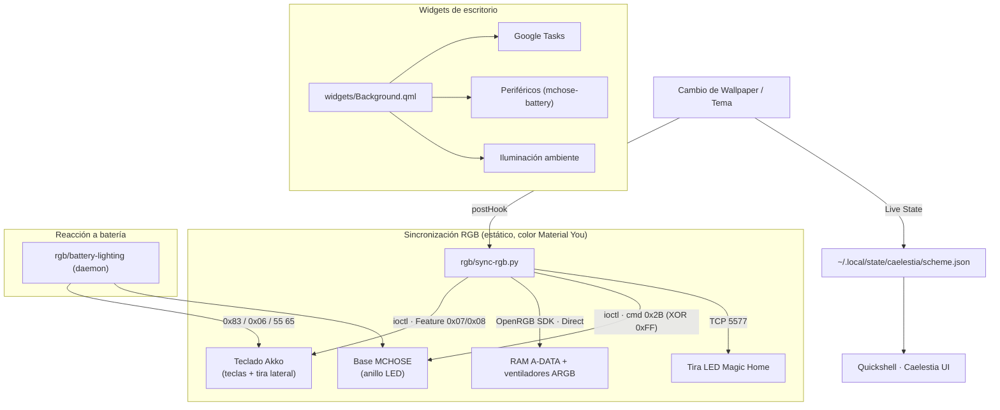

# 🌌 LinuxRicing

Mi rice de **Hyprland + Quickshell (Caelestia)** con Material You dinámico, en el que
**todos los periféricos reaccionan a la paleta del wallpaper** — y la ingeniería
inversa de cada dispositivo está documentada en abierto para quien la quiera usar.

Dual-boot **Linux + Windows**.

---

## Contexto

Empecé cogiendo [Caelestia](https://github.com/caelestia-dots/caelestia) (shell de
Quickshell, GPL-3.0) y lo fui personalizando: barra, dashboard, lock, un panel de
control de iluminación propio, widgets de escritorio, integración con Google Tasks,
Spotify tematizado…

El problema: cuando cambio el fondo de pantalla, [Matugen](https://github.com/InioX/matugen)
genera una paleta Material You nueva y el escritorio entero se recolorea — pero el
teclado, el ratón y las luces se quedaban como estaban. Para que **el hardware
siguiera al tema** hubo que descifrar el protocolo USB de cada cacharro: el teclado
Akko (dos zonas de RGB + batería), la base del ratón MCHOSE, los auriculares, la
placa y las RAM por OpenRGB, y una tira LED Wi-Fi.

Todo ese trabajo de ingeniería inversa está en **[`hardware/`](hardware/)**,
organizado por dispositivo: qué es, sus identificadores USB, el protocolo
decodificado, qué se ha conseguido y qué no.

---

## Inicio rápido

```bash
git clone https://github.com/Alberviz/LinuxRicing.git
cd LinuxRicing
./install.sh
```

`install.sh` es modular: detecta si es portátil o sobremesa y ofrece un menú
(Hyprland, Caelestia, widgets, Google Tasks, Spicetify, control RGB, opciones de
portátil). Hace backup de lo que reemplaza y recarga Caelestia al terminar.

> Las rutas activas del sistema son **copias**, no symlinks: tras cambiar algo en el
> repo hay que reinstalar o copiar el archivo a su ruta (ver
> [enlaces repo ↔ sistema](#enlaces-repo--sistema)).

---

## Qué hay dentro

| Carpeta | Qué es |
|---|---|
| [`configs/`](configs/) | Dotfiles: Hyprland, el fork de Quickshell·Caelestia, Spicetify. |
| [`widgets/`](widgets/) | Widgets de escritorio (`Background.qml`) y CLIs: `gtasks`, `mchose-battery`, `magichome-control`. |
| [`rgb/`](rgb/) | Drivers y sincronización RGB: `sync-rgb.py`, `akko-rgb`, `mchose-lighting`, el daemon `battery-lighting`, tests. |
| [`hardware/`](hardware/) | **Base de conocimiento de ingeniería inversa, por dispositivo.** |
| [`systemd/`](systemd/) | Unidades systemd de usuario (`openrgb`, `battery-lighting`, `argb-wave`). |
| [`docs/`](docs/) | Runbooks, traspasos de sesión, planes. (Los protocolos ya **no** viven aquí — están en `hardware/`.) |
| [`vault/`](vault/) | Bóveda de Obsidian: la narrativa, el diario y la investigación. Enlaza a `hardware/`. |

---

## Conocimiento de hardware

Fuente canónica: **[`hardware/README.md`](hardware/README.md)**.

| Dispositivo | Iluminación | Batería | Notas |
|---|---|---|---|
| **Teclado Akko 5075B Plus** (`3151:4015` / `3151:4011`) | ✅ teclas + tira lateral | ✅ opcode `0x83` | Per-key funciona pero solo estático: animarlo por 2.4 GHz satura la radio. |
| **Ratón MCHOSE K7 Ultra + Base 8K** (`3837:1001` / `3837:4150`) | ✅ anillo LED de la base | ✅ cmd `0x06` | Payload ofuscado con `XOR 0xFF`. Sin RGB per-LED (quemado en ROM). |
| **Auriculares MCHOSE V9 Pro** (`291D:385D`) | ❌ sin RGB | ✅ 2.4 GHz (`55 65`); 🚧 BT | Batería por Bluetooth: sniff hecho, pendiente de documentar. |
| **Placa ASUS TUF B560M + RAM A-DATA** | ✅ vía OpenRGB (modo Direct) | — | Bus I2C lento → `main` es one-shot; `feature/argb-wave` anima a ~12.5 FPS. |
| **Tira LED Magic Home** (Wi-Fi `:5577`) | ✅ color sólido | — | Por red (`flux_led`), no USB. |

---

## Arquitectura



---

## Ramas

| Rama | RGB de RAM y ventiladores | Cuándo |
|---|---|---|
| **`main`** | Color sólido, un disparo al cambiar de tema. | Uso diario. Evita saturar el bus I2C de las RAM (ver [`hardware/asus-tuf-b560m/`](hardware/asus-tuf-b560m/)). |
| **`feature/argb-wave`** | `main` + daemon `rgb/argb-wave.py` con ola de color continua a ~12.5 FPS. | Cuando quieras la ola en vez de color fijo. |

```bash
git checkout feature/argb-wave
systemctl --user enable --now argb-wave.service
```

---

## Linux vs Windows

El repo vive en los dos sistemas del dual-boot. Cada sincronizador RGB es específico
de su SO — usan APIs de HID distintas y **no comparten código**:

| Archivo | Sistema | Notas |
|---|---|---|
| `rgb/sync-rgb.py` | Linux | `/dev/hidraw*` vía `fcntl.ioctl`. Lee el tema de Caelestia. |
| `rgb/argb-wave.py` | Linux (rama `feature/argb-wave`) | Daemon, servidor OpenRGB. |
| `rgb/sync-rgb-windows.py` | Windows | `hidapi` + fallback gRPC al driver de Akko. Color del wallpaper de Windows. |
| `rgb/mchose-battery` / `rgb/mchose-battery-windows.py` | Linux / Windows | Telemetría de batería, implementaciones paralelas. |
| `hardware/` | Ambos | Los opcodes y payloads HID son los mismos en los dos SO. |
| `configs/`, `widgets/`, `systemd/` | Solo Linux | Quickshell / Caelestia / systemd de usuario. |

⚠️ **Al corregir un bug de protocolo** (p. ej. un opcode del Akko) hay que aplicarlo
en `sync-rgb.py` **y** en `sync-rgb-windows.py`.

---

## Enlaces repo ↔ sistema

Las rutas activas en Linux son copias independientes:

- **Scripts RGB:** `~/.config/caelestia/sync-rgb.py`, perfiles `~/.config/caelestia/*.json`
- **Binarios CLI:** `~/.local/bin/` (`gtasks`, `mchose-battery`, `magichome-control`, `battery-lighting`)
- **Shell:** `~/.config/quickshell/caelestia/`
- **Widgets:** `~/.config/quickshell/caelestia/modules/background/Background.qml`
- **Systemd:** `~/.config/systemd/user/` (`openrgb.service`, `battery-lighting.service`, + `argb-wave.service` en su rama)

Tras fusionar un cambio hay que volver a copiar el archivo a su ruta activa (o correr
`install.sh`) para que el hook de Caelestia use la versión nueva.

---

## Créditos y licencia

- [Caelestia](https://github.com/caelestia-dots/caelestia) — el shell de Quickshell del
  que parte todo esto (GPL-3.0; licencia y atribución conservadas en
  `configs/quickshell/caelestia/LICENSE`).
- [OpenRGB](https://openrgb.org/), [Matugen](https://github.com/InioX/matugen),
  [flux_led](https://github.com/Danielhiversen/flux_led).
- Proyectos de la comunidad que sirvieron de referencia para la RE: `akko-bpf-battery`
  y el subsistema HID-BPF del kernel (6.12+). Contexto en
  `vault/Rice LinuxRicing/00 - Arquitectura/Estado del Arte e Ingeniería Inversa en la Comunidad.md`.

El código propio de este repo (scripts de `rgb/`, widgets, documentación de
`hardware/`) es de uso libre. Los componentes derivados de Caelestia mantienen su
licencia GPL-3.0.
