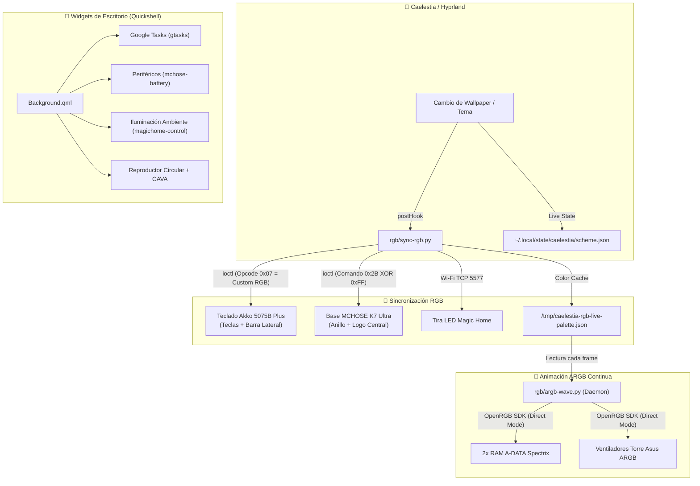

# 🌌 Linux Ricing & Hardware Ecosystem

Repositorio maestro y centralizado de personalización, widgets de escritorio, controladores de hardware propietarios y sincronización RGB dinámica para el entorno **Caelestia / Hyprland / Quickshell** con soporte Dual-Boot (Linux & Windows).

---

## 🔀 Esta es la rama `feature/argb-wave`

| Rama | Comportamiento del RGB |
|---|---|
| `main` | Solo color **sólido / estático**, un único disparo (`sync-rgb.py`) por cambio de tema. |
| **`feature/argb-wave`** (esta) | Todo lo de `main` **más** `rgb/argb-wave.py`: un daemon (`argb-wave.service`) que anima con una ola de color continua las zonas direccionables (RAM + ventiladores ARGB) a ~12.5 FPS, leyendo la paleta en vivo desde `sync-rgb.py`. El teclado, la base MCHOSE y la tira Magic Home siguen siempre en estático — nunca se animan. |

Para volver al estático puro: `git checkout main` y `systemctl --user disable --now argb-wave.service`.

---

## 🪟🐧 Qué es de Linux y qué es de Windows

| Archivo | Sistema | Notas |
|---|---|---|
| `rgb/sync-rgb.py` | **Solo Linux** | Lee el tema de Caelestia/Hyprland. Usa `/dev/hidraw*` vía `fcntl.ioctl`. |
| `rgb/argb-wave.py` | **Solo Linux** | Daemon systemd, depende del servidor OpenRGB de Linux. Solo existe en esta rama. |
| `rgb/sync-rgb-windows.py` | **Solo Windows** | Extrae el color del wallpaper de Windows directamente. Usa `hidapi` + fallback gRPC al driver de Akko. |
| `docs/HARDWARE_PROTOCOLS.md` | **Ambos** | Especificación de protocolos de hardware, válida independientemente del SO. |
| `widgets/`, `systemd/`, `configs/` | **Solo Linux** | Específicos de Quickshell/Caelestia/systemd de usuario. |

⚠️ **`sync-rgb.py` y `sync-rgb-windows.py` son implementaciones paralelas del mismo protocolo, no comparten código.** Un fix de protocolo (p. ej. opcodes del teclado Akko) hay que aplicarlo a mano en los dos.

---

## 📁 Estructura del Repositorio

```text
LinuxRicing/
├── README.md                      # Esta guía maestra
├── docs/                          # Documentación técnica y contextos
│   ├── CONTEXTO_WIDGETS_BACKGROUND.md # Contexto de widgets de escritorio (Background.qml)
│   ├── HARDWARE_PROTOCOLS.md      # Especificación técnica de protocolos USB HID y red
│   ├── RGB_HANDOVER_LINUX.md      # Informe de retorno y transición a Linux
│   ├── RGB_HANDOVER_WINDOWS.md    # Guía de ingeniería inversa en Windows
│   └── promptWindows              # Prompt de contexto para sesiones Windows
│
├── rgb/                           # Sincronización e Iluminación RGB
│   ├── sync-rgb.py                # Sincronizador maestro para Linux (One-Shot / Caelestia Hook)
│   ├── argb-wave.py               # Daemon de animación continua ARGB (RAMs + Ventiladores)
│   └── sync-rgb-windows.py        # Sincronizador unificado para Windows
│
├── widgets/                       # Widgets de escritorio y utilidades CLI
│   ├── Background.qml             # Componente de widgets Caelestia / Quickshell
│   ├── gtasks                     # Integración CLI / JSON con Google Tasks
│   ├── mchose-battery             # Telemetría de batería para periféricos (V9 Pro, K7 Ultra)
│   └── magichome-control          # Control CLI de tira LED Magic Home Wi-Fi
│
├── systemd/                       # Unidades Systemd de usuario
│   ├── openrgb.service            # Servidor SDK de OpenRGB en segundo plano
│   ├── argb-wave.service          # Daemon de ola ARGB reactiva
│   ├── mchose-battery.service     # Servicio de polling de batería
│   └── mchose-battery.timer       # Timer programado para telemetría
│
└── configs/                       # Archivos de configuración de Caelestia
    ├── cli.json                   # Hooks de post-cambio de tema y wallpaper
    └── shell.json                 # Configuración principal de Caelestia Shell
```

---

## 🎨 Arquitectura del Sistema



---

## 🚀 Comandos Rápidos

### 1. Sincronización RGB Manual
```bash
# Ejecutar sincronización manual con el tema activo
python3 ~/.config/caelestia/sync-rgb.py

# O desde el repositorio
python3 ~/LinuxRicing/rgb/sync-rgb.py
```

### 2. Gestión de Servicios Systemd
```bash
# Ver estado de los servicios RGB
systemctl --user status openrgb.service argb-wave.service

# Reiniciar animación de la ola
systemctl --user restart argb-wave.service

# Ver logs de la ola en tiempo real
journalctl --user -u argb-wave.service -f
```

### 3. Gestión del Shell de Caelestia
```bash
# Reiniciar el entorno Quickshell / Caelestia
caelestia shell -k ; sleep 0.5 ; caelestia shell -d

# Ver logs de widgets y shell
caelestia shell -l
```

---

## 📌 Enlaces entre el Repositorio y el Sistema

Para que el sistema ejecute siempre la versión en vivo, las rutas activas en el sistema operativo están ubicadas en:
- **Scripts RGB:** `~/.config/caelestia/sync-rgb.py` y `~/.config/caelestia/argb-wave.py`
- **Widgets QML:** `/etc/xdg/quickshell/caelestia/modules/background/Background.qml`
- **Binarios CLI:** `~/.local/bin/` (`gtasks`, `mchose-battery`, `magichome-control`)
- **Systemd:** `~/.config/systemd/user/` (`openrgb.service`, `argb-wave.service`, etc.)

Estas rutas son **copias independientes**, no symlinks: tras cambiar algo aquí hay que volver a copiar el archivo a su ruta activa (p. ej. `cp rgb/sync-rgb.py ~/.config/caelestia/sync-rgb.py`) para que el hook de Caelestia lo use.
