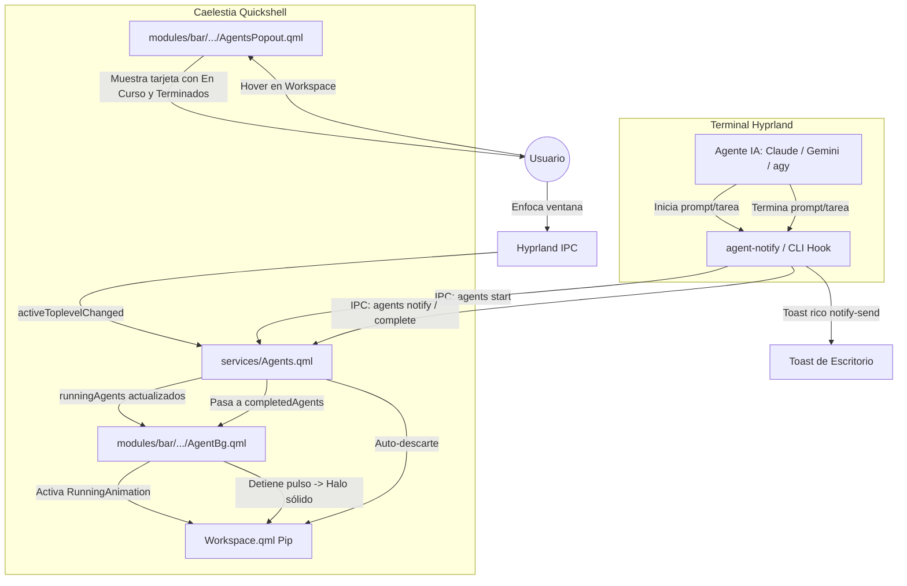

# Indicador «En Curso» (*Running Pulse*) de Agentes en el Pip de Workspace — Diseño v2

**Fecha:** 2026-08-30  
**Rama:** `feat/agent-running-pulse`  
**Estado:** Implementado (commit `ea42e44`). Ver "Ajustes en implementación" al final.  
**Autores:** Claude & Gemini  
**Referencia base:** [`docs/superpowers/specs/2026-08-29-agent-notifications-workspace-pip-design.md`](file:///home/alberviz/LinuxRicing/docs/superpowers/specs/2026-08-29-agent-notifications-workspace-pip-design.md)

---

## 1. Problema y Motivación

En la **Fase 1 (v1)**, el sistema de notificaciones de agentes solo avisa cuando una tarea ha terminado (*Completed*), encendiendo un halo luminoso estático y un puntito de «sin ver» en el pip del workspace correspondiente.

Sin embargo, cuando el usuario le pasa un prompt a **Antigravity, Gemini o Claude Code** y se cambia a otro workspace a continuar con su trabajo:
1. **Incertidumbre operativa:** No hay indicación visual de si el agente sigue pensando, ejecutando herramientas, compilando o si el proceso se ha detenido o cancelado.
2. **Falta de feedback en vivo:** La barra permanece estática hasta que llega el aviso final.
3. **Multi-agente ciego:** Si hay 2 o 3 agentes trabajando en paralelo en distintos workspaces (ej. Gemini en WS 5 redactando docs, Claude en WS 3 refactorizando QML), el usuario no sabe cuáles siguen activos sin cambiar de workspace.

---

## 2. Objetivos de Diseño

1. **Visualización de «En Curso» (*Busy / Running*):**
   - Mientras un agente ejecuta un comando o procesa un prompt, el pip del workspace donde vive muestra una **respiración/pulso luminoso suave** (*pulsing halo*).
   - El color del pulso es un tono diferenciado (ej. color terciario / acento secundario / cian suave) para distinguirse claramente del estado «Terminado» (acento primario sólido).
2. **Transición fluida de estados:**
   - `IDLE` (pip normal) ➔ `RUNNING` (halo con pulso continuo) ➔ `COMPLETED` (halo sólido + puntito de sin ver) ➔ `DISMISSED` (retorno a normal al enfocar).
3. **Múltiples vías de disparo e integración:**
   - **A. Envoltorio `run`:** `agent-notify run` emite `start` al iniciar y `complete` al terminar.
   - **B. Disparo explícito CLI:** `agent-notify start` y `agent-notify finish`.
   - **C. Interceptor DBus / Hook pasivo:** Interceptores de inicio de actividad en shell (`preexec` / hook de terminal).
4. **Inspección en Hover (`AgentsPopout`):**
   - La tarjeta flotante muestra los agentes actualmente en ejecución con un contador de tiempo en vivo (*«Ejecutando desde hace 1m 12s»*) y el nombre de la tarea.

---

## 3. Arquitectura del Sistema



---

## 4. Contrato de Datos y Estados

### Estados de un Agente

| Estado | Significado | Representación Visual en Pip | En Tarjeta Popout |
| :--- | :--- | :--- | :--- |
| `running` | Ejecutando prompt o tarea | **Pulso / Respiración continua** (opacidad 0.35 ↔ 0.9, escala 0.96 ↔ 1.04) | Badge ⏳ *En curso (Xm Ys)* |
| `completed` | Tarea finalizada, pendiente de ver | **Halo sólido de acento primario** + **puntito de sin ver** | Badge 🤖 *Completado hace Xm* |
| `error` | Fallo en comando (`exit != 0`) | **Halo ámbar/rojo de advertencia** | Badge ⚠️ *Error (código N)* |

### Payload JSON de Agente

```json
{
  "id": "agent-1787977000000",
  "name": "Claude",
  "task": "Refactor del modelo de efectos RGB",
  "status": "running",
  "startTime": 1787977000000,
  "endTime": null,
  "duration": "",
  "address": "0x558f6720fed0",
  "ws": 3,
  "dir": "LinuxRicing",
  "terminal": "kitty",
  "seen": false
}
```

---

## 5. Cambios en Componentes

### 1. `configs/quickshell/caelestia/services/Agents.qml`

- **Propiedades:**
  - `property list<var> runningAgents: []`
  - `property list<var> completedAgents: []`
  - `readonly property var runningWsMap`: mapa `{ [wsId]: [agent1, ...] }`.
- **Métodos:**
  - `start(dataStr)`: Registra un agente en estado `running`. Si ya existía uno en esa ventana, lo actualiza.
  - `complete(dataStr)`: Mueve el agente de `runningAgents` a `completedAgents` con duración calculada y marca `seen: false`.
  - `hasRunningForWs(wsId)`: `true` si hay al menos un agente corriendo en ese workspace.
  - `hasCompletedForWs(wsId)`: `true` si hay agentes completados.
  - `dismiss(id)` / `dismissByAddress(address)`: Limpia tanto de `runningAgents` como de `completedAgents`.
- **IPC Handlers:**
  - `start(data)`
  - `complete(data)`
  - `listRunning()`

### 2. `configs/quickshell/caelestia/modules/bar/components/workspaces/AgentBg.qml`

- **Animación de Pulso (*Running Animation*):**
  ```qml
  readonly property bool hasRunning: Agents.hasRunningForWs(root.wsId)
  readonly property bool hasCompleted: Agents.agentsForWs(root.wsId).length > 0

  SequentialAnimation on opacity {
      running: root.hasRunning && !root.hasCompleted
      loops: Animation.Infinite
      NumberAnimation { to: 0.85; duration: 750; easing.type: Easing.InOutSine }
      NumberAnimation { to: 0.30; duration: 750; easing.type: Easing.InOutSine }
  }

  SequentialAnimation on scale {
      running: root.hasRunning && !root.hasCompleted
      loops: Animation.Infinite
      NumberAnimation { to: 1.04; duration: 750; easing.type: Easing.InOutSine }
      NumberAnimation { to: 0.96; duration: 750; easing.type: Easing.InOutSine }
  }
  ```
- **Color:** Si está en `running`, usa `Tokens.m3.secondary` o `Tokens.m3.tertiary`; si está en `completed`, usa `Tokens.m3.primary`.

### 3. `configs/quickshell/caelestia/modules/bar/popouts/AgentsPopout.qml`

- Incorpora sección superior para agentes en ejecución:
  - Glifo `sync` o `hourglass_top` giratorio/pulsante.
  - Texto *"Ejecutando: [Tarea]"* y temporizador transcurrido.
  - Botón de cancelación / foco directo.

### 4. `rgb/agent-notify` (CLI)

- **Subcomandos añadidos:**
  - `agent-notify start -n <Name> -t "<tarea>"`:
    Emite el evento IPC `start` con la ventana y workspace detectados.
  - `agent-notify finish -n <Name> -t "<tarea>"` (alias de `notify` con cálculo automático de duración desde el `start`).
- **Envoltorio `run` mejorado:**
  - Envía `start` antes de `subprocess.run(cmd)`.
  - Captura `returncode` y envía `complete` al finalizar con `duration` y `status`.

---

## 6. Plan de Pruebas y Validación

1. **Unit Tests en `rgb/tests/test_agent_notify.py`:**
   - Test de subcomando `start` y construcción de payload con `status: "running"`.
   - Test de transición `start` ➔ `finish`.
   - Test de duración calculada.
2. **Pruebas de UI QML:**
   - Inyección de agente en ejecución en workspace remoto: el pip correspondiente debe palpitar suavemente.
   - Disparo de finalización: el pulso debe detenerse y encenderse el halo estático y el puntito.
   - Hover sobre el pip: visualización correcta del tiempo de ejecución en vivo.
   - Enfoque de ventana: auto-descarte de estados.

---

## 7. Ajustes en implementación (2026-08-29)

Decisiones tomadas con Alberto en el brainstorming visual y desviaciones respecto al borrador:

### Recortes por YAGNI
- **Sin botón de cancelar agente** en el popout (solo foco directo).
- **Sin estado `error` / halo ámbar** en v2 — se aplaza. `finish -s "Error (N)"` se
  registra como completado normal.
- **Timer del popout simplificado:** "ejecutando desde hace X" se calcula al abrir la
  tarjeta, sin contador que refresca cada segundo.

### Lenguaje visual del marcador (nuevo)
- El halo pasa de **relleno** del pip a **contorno neón** (anillo + glow) que lo rodea.
- **En curso:** contorno **blanco parpadeando** (estilo `blink`, por defecto) o
  respiración en color de paleta (`breathe`). El estilo `arc` (trazo girando tipo
  spinner) queda **pendiente** — el `Loader`/switch ya está, solo falta la variante.
- **Al terminar:** el contorno pasa a **verde fijo** (`m3primary`).
- El puntito de 4 px de "sin ver" se sustituye por un **badge en la esquina** con
  contador y pulso suave (`badge`, por defecto) o una **cuña lateral** (`wedge`).
- Conmutable en caliente: `agent-notify style {blink|breathe|arc}` y
  `agent-notify marker {badge|wedge}` escriben `~/.config/caelestia/agents-config.json`
  (mirror en `Agents.qml`, `watchChanges`).

### Disparadores (decisión final)
- **Claude Code → hooks.** `~/.claude/settings.json` con `UserPromptSubmit` →
  `agent-notify hook prompt` y `Stop` → `agent-notify hook stop`. El CLI lee el JSON
  del hook por stdin (`cwd`, `prompt`). El proceso del hook es descendiente de Claude,
  así que el árbol de procesos resuelve el terminal exacto sin heurísticas.
- **Antigravity → interceptación en `Notifs.qml`** (sin hooks). Claude se quita de la
  interceptación (lo poseen los hooks); dedup por `address` evita duplicados.
- **Sin wrappers de shell.** `agent-notify run -- <bin>` sigue disponible para uso
  manual, pero no se instalan alias de `claude` / `agy`.

### Bug de v1 resuelto de camino
El halo "no salía en el workspace que tocaba" **no** era la resolución de PID: era
`AgentBg` posicionando el halo en `pip.y` (relativo al `ColumnLayout` de workspaces)
sin sumar el offset del propio layout — igual que `ActiveIndicator` suma `mask.y`.
Con el workspace activo alto (iconos de ventana) el halo se desplazaba uno o dos pips
hacia arriba. `AgentBg` ahora recibe `layout` y usa `pip.y + layout.y`.
(`OccupiedBg.qml` arrastra el mismo bug pero está desactivado por defecto — anotado.)

---

## 8. Futuro (fuera de v2)

### Halo para notificaciones generales
Extender el mecanismo de "halo persistente + auto-descarte al visitar el workspace" a
**cualquier notificación**, no solo agentes. Cuando un toast expira sin que el usuario
haga clic, se convierte en un halo en el workspace de origen hasta que lo visita.

- **Reutiliza** `completedAgents` / `wsMap` / `markSeen` / descarte al enfocar (ya genérico).
- **Gancho:** `Notifs.qml` `onNotification` + expiración del popup.
- **Resolución de workspace:** por `appName` / `desktopEntry` → ventana en `hyprctl
  clients`. Fiable si hay **una sola** ventana de esa app; si hay varias o la manda un
  demonio sin ventana, cae al workspace activo o se ignora.
- **Alcance acordado con Alberto:** solo notificaciones **urgentes/críticas**
  (`urgency: critical`) o lista de apps permitida en config. **Color distinto** del de
  agente (cian `m3tertiary` vs verde `m3primary`). El halo **auto-expira** a los ~10 min
  aunque no se visite (a diferencia del de agente). **Sin** estado "en curso" — eso es
  exclusivo de agentes.
- Feature propia, rama aparte, después de v2 + sonidos.

### Estilo de pulso `arc`
Tercera variante de la animación "en curso": un trazo/arco neón girando alrededor del
pip (tipo spinner). El `Loader`/switch por `runningStyle` ya está; falta la variante
(`Shape` o `Canvas` rotando, ~40 líneas).
