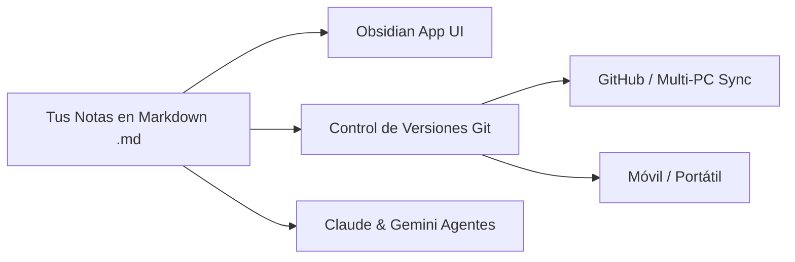
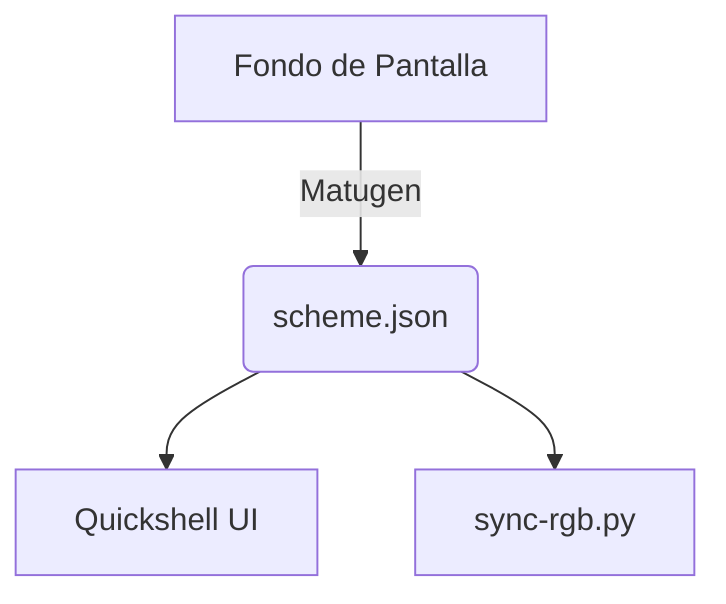

# 📚 Guía Completa de Obsidian para Alberto

¡Bienvenido a **Obsidian**! Esta guía está pensada para que entiendas qué es, por qué es la mejor herramienta para gestionar tu setup, y cómo sacarle el 100% de provecho junto a Claude y Gemini.



---

## 🧭 1. ¿Qué es Obsidian y cómo funciona?

A diferencia de Notion, Evernote o OneNote:
- **Obsidian NO guarda tus notas en una nube propietaria ni en una base de datos opaca**: guarda simples **archivos de texto Markdown (`.md`) en una carpeta local de tu disco** (denominada *Vault* o Bóveda).
- **Es tuyo para siempre**: si el día de mañana desinstalas Obsidian, todas tus notas, tablas y diagramas siguen intactos y legibles con cualquier editor (VS Code, Nano, Kate o el navegador).
- **Colaboración en tiempo real con IAs**: Como son archivos normales en `~/LinuxRicing/vault/`, Claude y Gemini podemos leer, crear, reorganizar y documentar todo directamente mientras tú lo ves actualizarse en vivo en tu pantalla.

---

## ⚡ 2. Conceptos Clave en 2 Minutos

### A. Enlaces Bidireccionales (`[[Wikilinks]]`)
La magia de Obsidian reside en conectar ideas. Escribe dos corchetes `[[Nombre de la Nota]]` para crear un enlace instantáneo. 
- Ejemplo: `[[Rice LinuxRicing/Arquitectura General del Setup|Ver Arquitectura]]`.
- Si cambias el nombre de una nota en Obsidian, **todos los enlaces del vault se actualizan automáticamente**.

### B. Etiquetas (`#tags`) y Metadatos (YAML Frontmatter)
Al principio de cada nota colocamos metadatos estructurados entre `---`:
```yaml
---
tags: [rice, rgb, roadmap]
estado: en_desarrollo
prioridad: alta
---
```
Esto permite filtrar, buscar y crear tablas dinámicas con el plugin **Dataview**.

### C. Cajas de Alerta (*Callouts*)
Para resaltar información importante con colores y estilos nativos:
> [!NOTE]
> Esto es una nota explicativa o de contexto.

> [!TIP]
> Un truco o consejo de rendimiento.

> [!IMPORTANT]
> Información crítica que no debes olvidar.

> [!WARNING]
> Cuidado con posibles incompatibilidades o errores.

### D. Diagramas Nativos (*Mermaid*)
Puedes crear diagramas de flujo y arquitectura escribiendo bloques ` ```mermaid `:


### E. Vista de Grafo (*Graph View*)
Pulsa `Ctrl + G` en Obsidian para abrir la **constelación visual de tu conocimiento**: verás todas las notas de tu setup flotando como nodos conectados entre sí en un mapa espacial interactivo.

---

## ☁️ 3. ¿Cómo sincronizar tu Bóveda entre varios ordenadores o el móvil?

Tienes 4 opciones excelentes. La **Opción 1** ya la tienes configurada y es 100% gratuita:

### 🥇 Opción 1: Git / GitHub (Recomendada & Lista)
Tu vault vive dentro de tu repositorio `~/LinuxRicing/vault/`.
- **En otro PC (Linux / Windows / Mac):**
  1. Clonas tu repo: `git clone git@github.com:Alberviz/LinuxRicing.git`
  2. Abres Obsidian y seleccionas *"Open folder as vault"* apuntando a la carpeta `LinuxRicing/vault`.
  3. Para sincronizar: `git pull` antes de trabajar y `git push` al terminar (o usando el plugin comunitario *Obsidian Git* para sync automático).

---

### 🥈 Opción 2: Syncthing (P2P Gratuito en Tiempo Real)
Ideal si quieres sincronizar con tu móvil Android o portátil sin pasar por GitHub:
1. Instalas `syncthing` en tu PC (`sudo pacman -S syncthing`) y en tu móvil/portátil.
2. Compartes la carpeta `~/LinuxRicing/vault`.
3. Cualquier letra que escribas en el PC se refleja en el móvil en 1 segundo vía red local o internet seguro, sin servidores de terceros.

---

### 🥉 Opción 3: Plugin "Remotely Save" (Google Drive / OneDrive / Dropbox / S3)
1. En Obsidian, vas a *Ajustes* → *Community Plugins* → Instalas **Remotely Save**.
2. Conectas tu cuenta de Google Drive o Dropbox.
3. Se sincroniza automáticamente en segundo plano.

---

### 💎 Opción 4: Obsidian Sync (Oficial)
- Servicio de pago oficial de Obsidian ($4/mes) con cifrado de extremo a extremo y soporte para historial de versiones móvil/escritorio con 1 clic.

---

## 🎯 4. Cómo nos repartimos el trabajo contigo

1. **Claude y Gemini somos tus arquitectos y documentalistas**:
   - Cuando investiguemos hardware, creemos herramientas o diseñemos planes, los redactamos en el Vault para que te quede una enciclopedia visual perfecta.
2. **Tú eres el director de orquesta**:
   - Puedes crear notas rápidas en la carpeta `Inbox/` (ej. *"Probar nuevo shader de Hyprland"*) y nosotros las clasificamos, investigamos y añadimos al backlog.
