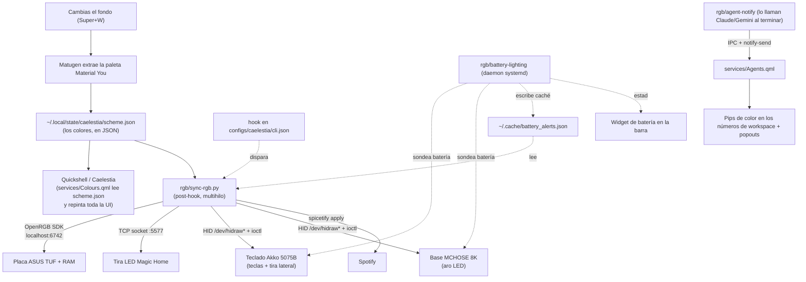

# 🧑‍💻 Guía del Código para Alberto

> [!abstract] Para qué es esta nota
> El día que quieras sentarte a **leer el proyecto de arriba abajo y empezar a tocar código
> a mano**, empieza por aquí. No hace falta que sepas de antemano ningún lenguaje: esta guía
> te explica **qué lenguajes hay y para qué sirve cada uno**, **cómo está organizado el
> repositorio**, **cómo fluyen los datos** entre las piezas, y **cómo cambiar cosas sin
> romper el setup en vivo**.
>
> Complementa a [[Guía de Obsidian para Alberto]] (esa es sobre la bóveda; esta es sobre el
> código) y a [[Rice LinuxRicing/00 - Arquitectura/Arquitectura General del Setup|🏛️ Arquitectura General del Setup]].

---

## 1. La idea del proyecto en una frase

Cambias el fondo de pantalla → un programa extrae la paleta de colores del fondo → **todo
reacciona a esa paleta**: la interfaz del escritorio, el teclado, el ratón, la placa base,
la RAM y una tira LED Wi-Fi. Además hay telemetría de batería de los periféricos
inalámbricos y un sistema de avisos visuales para agentes de IA (Claude / Gemini).

Todo lo que hace eso posible son **scripts propios** (carpeta `rgb/`), **módulos de
interfaz** (carpeta `configs/quickshell/` y `widgets/`) y una **base de conocimiento de
ingeniería inversa** de los protocolos USB de cada aparato (carpeta `hardware/`).

---

## 2. Ruta de lectura recomendada

Hazlo en este orden; cada paso te prepara para el siguiente.

1. **[`README.md`](file:///home/alberviz/LinuxRicing/README.md)** (raíz del repo) — visión
   general, tabla de dispositivos y diagrama de arquitectura. Está en inglés pero es corto.
2. **[[Rice LinuxRicing/00 - Arquitectura/Arquitectura General del Setup|🏛️ Arquitectura General del Setup]]** — el mismo mapa pero en español y con los atajos de teclado.
3. **Esta guía, sección 4** (mapa del repositorio) y **sección 5** (el flujo de datos central).
4. **Sección 6** — los programas principales, uno a uno.
5. **[`hardware/README.md`](file:///home/alberviz/LinuxRicing/hardware/README.md)** — cómo se hablan las máquinas con los cacharros.
6. **[[Rice LinuxRicing/00 - Arquitectura/Roadmap Maestro de Innovaciones|🔮 Roadmap Maestro de Innovaciones]]** y **[[🎯 Hoy]]** — a dónde va esto.

> [!tip] Truco para leer código sin saber el lenguaje
> Abre el archivo y lee **solo**: (a) el comentario de cabecera (arriba del todo, entre
> `"""` o después de `#`), (b) los nombres de las funciones (`def nombre_funcion(...)`), y
> (c) el bloque `if __name__ == "__main__":` del final, que es "por dónde empieza a
> ejecutarse". Con eso entiendes el 80% sin leer la lógica interna.

---

## 3. Los lenguajes que vas a encontrar

| Lenguaje | Dónde vive | Para qué sirve aquí | Cómo se ejecuta |
|---|---|---|---|
| **Python 3** (`.py` y scripts sin extensión en `rgb/`) | `rgb/`, `widgets/gtasks`, `widgets/mchose-battery` | Toda la lógica: hablar con el hardware por USB, extraer colores, daemons de batería, el CLI de avisos de agentes | `python3 archivo` o directamente `./archivo` si es ejecutable |
| **QML** (`.qml`) + **JavaScript** embebido | `configs/quickshell/caelestia/`, `widgets/Background.qml` | La interfaz del escritorio: barra, widgets, OSD de volumen/brillo, panel de control, popouts de agentes | Lo carga **Quickshell** (motor de Qt); no se "compila" |
| **Lua** (`.lua`) | `configs/hypr/` | Configuración de **Hyprland** (el gestor de ventanas Wayland): atajos, reglas de ventana, autostart, animaciones | Lo lee Hyprland al arrancar |
| **Bash** (`.sh`) | `install.sh`, algún helper | El instalador modular que copia archivos del repo a tu sistema | `./install.sh` |
| **JSON** (`.json`) | `configs/`, cachés en `~/.cache/` y `~/.local/state/` | Ficheros de configuración y de estado que los programas se pasan entre sí (p. ej. `scheme.json` con la paleta) | Datos, no código |
| **systemd unit** (`.service`) | `systemd/` | Definen los servicios de fondo (daemon de batería, OpenRGB) para que arranquen solos | `systemctl --user ...` |
| **Rust** | *No es código nuestro* | **Matugen**, la herramienta externa que extrae la paleta Material You del fondo | Se instala aparte |

### Lo mínimo que conviene saber de cada uno

**Python** — El lenguaje "de scripting" por excelencia. Indentación (sangría) obligatoria
en vez de llaves. Aquí se usa **casi solo la librería estándar** (nada exótico que instalar,
salvo `openrgb-python` y `flux_led`). Los ficheros de `rgb/` que **no tienen extensión**
(`battery-lighting`, `agent-notify`, `mchose-battery`, `akko-rgb`...) también son Python:
no llevan `.py` porque se instalan como comandos en `~/.local/bin/` y así se invocan con un
nombre limpio.

**QML** — Lenguaje declarativo de Qt para describir interfaces: escribes un árbol de
componentes (`Rectangle { ... Text { ... } }`) con propiedades, y cuando una propiedad
cambia la interfaz se redibuja sola (*reactividad*). Dentro de `{ }` puedes meter trozos de
**JavaScript** para la lógica. **Caelestia** es el nombre del shell (la colección de
módulos QML) sobre el que está construido este escritorio; nosotros tenemos un *fork*
modificado en `configs/quickshell/caelestia/`.

**Lua** — Lenguaje pequeño y sencillo, aquí solo para configurar Hyprland. Si quieres
cambiar un atajo de teclado, es `configs/hypr/config/binds.lua`.

---

## 4. Mapa del repositorio, carpeta por carpeta

```
LinuxRicing/
├── README.md              → Presentación (inglés). Empieza por aquí.
├── AGENTS.md / CLAUDE.md / GEMINI.md → Reglas para los agentes de IA. Léelas: explican el reparto de trabajo.
├── FUTURE_ROADMAP.md      → Visión a largo plazo con diagramas.
├── install.sh             → Instalador modular (Bash). Copia el repo al sistema vivo.
│
├── rgb/                   ← EL CEREBRO. Todos los scripts de Python.
│   ├── sync-rgb.py            Sincroniza la paleta del fondo con TODOS los aparatos. (~900 líneas)
│   ├── battery-lighting       Daemon de fondo: lee batería y dispara avisos de luz. (~1300 líneas)
│   ├── agent-notify           CLI de avisos de agentes de IA (Claude/Gemini). (~480 líneas)
│   ├── mchose-battery         Lee la batería del ratón/base MCHOSE por USB.
│   ├── akko-rgb / akko-poke   Controlan el RGB del teclado Akko.
│   ├── magichome-control      Controla la tira LED Wi-Fi.
│   ├── rgb-notify-flash       Efecto de "flash" de notificación en los LED.
│   ├── argb-wave.py           Efecto de onda para la RAM/placa vía OpenRGB.
│   ├── sync-rgb-windows.py    Versión para Windows (objetivo de paridad futura).
│   ├── *-test*.py, *-sniffer.py, *-analyzer.py → Herramientas de ingeniería inversa.
│   └── tests/                 Tests automáticos (pytest). Tu red de seguridad.
│
├── configs/              ← Dotfiles: la configuración del escritorio.
│   ├── hypr/                  Config de Hyprland (Lua). binds.lua = atajos.
│   ├── quickshell/caelestia/  El shell (interfaz). Fork de Caelestia.
│   │   ├── shell.qml             Punto de entrada del shell.
│   │   ├── modules/              Cada trozo de UI: bar/, dashboard/, osd/, launcher/,
│   │   │                         background/, rgbcontrol/, notifications/, lock/...
│   │   ├── services/             "Backend" del shell en QML: Colours.qml (paleta),
│   │   │                         Agents.qml (estado de agentes), Audio.qml, Weather.qml,
│   │   │                         BatteryLightingConfig.qml, RgbConfig.qml...
│   │   ├── components/           Piezas reutilizables (botones, tarjetas...).
│   │   └── utils/                Helpers.
│   ├── caelestia/             cli.json (el hook que dispara sync-rgb al cambiar tema),
│   │                          shell.json y rgb-config.json (semillas de config).
│   └── spicetify/             Tema de Spotify que también sigue la paleta.
│
├── widgets/              ← Widgets de escritorio y comandos sueltos.
│   ├── Background.qml         Lienzo del fondo (GEMELO de configs/.../background/Background.qml).
│   ├── gtasks                 Integración con Google Tasks.
│   ├── mchose-battery         GEMELO de rgb/mchose-battery.
│   ├── magichome-control      Helper de la tira LED.
│   └── desktop-deck-helper    Helper del "deck" 4-en-1 del escritorio.
│
├── hardware/            ← FUENTE CANÓNICA de la ingeniería inversa.
│   ├── README.md             Índice: qué aparato, qué IDs USB, qué está resuelto.
│   ├── akko-5075b-plus/       README.md + PROTOCOL.md + captures/*.pcapng
│   ├── mchose-k7-ultra/       (ratón + base de carga 8K)
│   ├── mchose-v9-pro/         (auriculares — solo batería)
│   ├── asus-tuf-b560m/        (placa base + RAM, vía OpenRGB)
│   └── magic-home-strip/      (tira LED Wi-Fi)
│
├── systemd/            ← Servicios de usuario (.service): openrgb, battery-lighting, argb-wave.
├── docs/               ← Runbooks, traspasos entre sesiones, planes y specs de diseño.
│   └── superpowers/          specs/ y plans/ — diseños detallados de cada feature grande.
└── vault/             ← Esta bóveda de Obsidian (territorio de Gemini normalmente).
```

> [!info] Reparto de trabajo entre agentes
> Por convención (ver `CLAUDE.md`): **Gemini** cuida `vault/`; **Claude** cuida `rgb/`,
> `configs/quickshell/`, `widgets/`, `docs/`, `hardware/`, `install.sh` y `systemd/`. Tú
> puedes tocar lo que quieras, pero si trabajas a la vez que un agente, avísale.

---

## 5. El flujo de datos central

Este es **el diagrama que tienes que entender**. Todo lo demás cuelga de aquí.



**En palabras:**

1. **Cambias el fondo.** Hyprland lanza el cambio; **Matugen** (Rust, externo) mira la
   imagen y saca ~30 colores Material Design 3.
2. Esos colores se guardan en **`scheme.json`** (un fichero JSON en
   `~/.local/state/caelestia/`). Ese fichero es **la única fuente de verdad del color**.
3. Dos consumidores reaccionan:
   - **La interfaz**: `services/Colours.qml` de Caelestia lee `scheme.json` y, como QML es
     reactivo, toda la UI se repinta sola.
   - **El hardware**: un *hook* configurado en `configs/caelestia/cli.json` ejecuta
     **`rgb/sync-rgb.py`**, que abre un hilo por dispositivo y le manda el color nuevo a
     cada uno con su protocolo particular.
4. En paralelo y para siempre, el daemon **`battery-lighting`** sondea la batería de los
   inalámbricos. Si algo está bajo o cargando, "reserva" una zona de LED para un aviso
   (escribe `~/.cache/battery_alerts.json`) y `sync-rgb.py` respeta esa zona en vez de
   pisarla con el color del tema.
5. Cuando un agente de IA termina una tarea, llama a **`agent-notify`**, que manda el
   estado por IPC de Hyprland a `services/Agents.qml`, que enciende un pip de color en el
   número del workspace y ofrece un popout con el detalle.

---

## 6. Los programas principales, uno a uno

### `rgb/sync-rgb.py` — el sincronizador
- **Qué hace:** recibe (o lee de `scheme.json`) un color y lo aplica a placa+RAM (OpenRGB),
  tira LED (TCP), teclado Akko (HID), base MCHOSE (HID) y Spotify (spicetify).
- **Por dónde entra:** al final del archivo, `main()`. Antes, la constante
  `DEFAULT_RGB_CONFIG` te enseña **todas** las opciones que soporta (por dispositivo:
  animación, color fijo vs. tema, velocidad, dirección).
- **Conceptos:** abre `/dev/hidraw*`, identifica cada aparato por su **Vendor:Product ID**
  (p. ej. Akko `3151:4015`), y envía *feature reports* con `fcntl.ioctl`. Sube la
  saturación del color antes de mandarlo porque los LED físicos se ven apagados si no.
- **Gemelo Windows:** `rgb/sync-rgb-windows.py` (usa `hidapi` en vez de `hidraw`).

### `rgb/battery-lighting` — el daemon de batería y avisos
- **Qué hace:** bucle infinito que cada X segundos lee la batería del teclado y del ratón,
  guarda el nivel en caché, y decide si mostrar un aviso lumínico (p. ej. la tira lateral
  del teclado en "snake" ámbar si está cargando).
- **Se arranca solo** vía `systemd/battery-lighting.service`.
- Es el archivo más grande (~1300 líneas) porque contiene la **máquina de estados** de los
  avisos y la lógica de "quién manda sobre cada zona de LED".
- **Tests:** `rgb/tests/test_battery_*.py` cargan este archivo como módulo (mira
  `rgb/tests/conftest.py`) y prueban la lógica sin tocar hardware real.

### `rgb/agent-notify` — el CLI de avisos de agentes
- **Qué hace:** lo llaman Claude y Gemini (a mano o envolviendo un comando con
  `agent-notify run ...`). Captura repo, duración y ventana de Hyprland y lo manda a la UI.
- **Solo librería estándar** de Python (`argparse`, `json`, `subprocess`, `pathlib`).
- **Contraparte en QML:** `configs/quickshell/caelestia/services/Agents.qml` +
  `modules/bar/` (los pips) + los popouts.
- **Diseño detallado:** `docs/superpowers/specs/2026-08-30-agent-running-pulse-*.md`.

### `rgb/mchose-battery` — lector de batería del ratón
- Habla con la base/dongle MCHOSE (`3837:xxxx`) por HID. El payload va **ofuscado con
  `XOR 0xFF`** y checksum; todo eso está documentado en `hardware/mchose-k7-ultra/PROTOCOL.md`.
- **Gemelo:** `widgets/mchose-battery` debe ser **idéntico** (`diff -q` sin salida).

### Los módulos QML de `configs/quickshell/caelestia/`
- `shell.qml` es la raíz. `modules/` son las piezas visibles (barra, dashboard, OSD,
  launcher, `rgbcontrol/` = el centro de iluminación, `background/`...).
- `services/` es el "backend": objetos QML globales que exponen datos (paleta, clima,
  audio, estado de agentes, config de RGB y batería) al resto de módulos.
- `widgets/Background.qml` es **gemelo** de
  `configs/quickshell/caelestia/modules/background/Background.qml`.

---

## 7. Cómo el repo se conecta con el sistema vivo

> [!warning] Los archivos instalados son COPIAS, no enlaces
> Editar un archivo en el repo **no cambia nada en tu escritorio** hasta que lo copias a su
> destino activo. Y al revés: si tocaste algo directamente en `~/.config/` sin pasar por el
> repo, ese cambio no está versionado.

| En el repo | En el sistema | Qué es |
|---|---|---|
| `configs/quickshell/caelestia/` | `~/.config/quickshell/caelestia/` | El shell (UI) |
| `widgets/Background.qml` | `~/.config/quickshell/caelestia/modules/background/Background.qml` | Fondo |
| `rgb/sync-rgb.py` | `~/.config/caelestia/sync-rgb.py` | Post-hook de color |
| `rgb/{agent-notify,battery-lighting,mchose-battery,...}` | `~/.local/bin/` | Comandos y daemons |
| `configs/hypr/` | `~/.config/hypr/` | Config de Hyprland |
| `systemd/*.service` | `~/.config/systemd/user/` | Servicios de fondo |

**`install.sh`** hace todas esas copias con un menú modular (detecta si es sobremesa o
portátil). Tras editar algo del repo: vuelve a pasar `install.sh` o copia el archivo a mano.

---

## 8. Ingeniería inversa de hardware (carpeta `hardware/`)

Cada aparato inalámbrico habla un "idioma" USB propio que hubo que descubrir capturando
tráfico con Wireshark mientras el software oficial del fabricante lo controlaba.

- `hardware/<aparato>/README.md` → identidad (IDs USB), estado (qué funciona) e historia.
- `hardware/<aparato>/PROTOCOL.md` → la especificación: **opcodes** (el número de comando,
  p. ej. `0x83` = "dame la batería" del Akko), estructura del paquete, **checksum**.
- `hardware/<aparato>/captures/*.pcapng` → las capturas Wireshark originales.

**Regla:** si descubres o corriges algo de un protocolo, se actualiza **en `hardware/`**, y
el vault solo cuenta la narrativa y enlaza. `docs/` ya no lleva specs de dispositivo.

Para capturar en Windows: `docs/WINDOWS_USB_CAPTURE_RUNBOOK.md` (tiene el entorno que
funciona y los fallos conocidos).

---

## 9. Cómo tocar código sin romper nada

> [!success] Checklist antes de dar algo por bueno
> 1. **Python:** `python -m py_compile rgb/battery-lighting rgb/sync-rgb.py` (comprueba
>    sintaxis sin ejecutar).
> 2. **Tests:** `python -m pytest rgb/tests` (deben pasar todos).
> 3. **UI/QML:** sincroniza el archivo a `~/.config/quickshell/caelestia/`, comprueba que
>    los **gemelos** siguen idénticos (`diff -q A B`, sin salida) y **reinicia el shell**:
>    ```bash
>    caelestia shell -k 2>/dev/null || pkill -f "qs -c caelestia" 2>/dev/null || true; sleep 1; caelestia shell -d
>    ```
>    La salida debe decir `INFO: Configuration Loaded` sin errores de propiedades QML.
> 4. **Git:** para un arreglo suelto, commit directo en la rama activa. Para una **feature**
>    (algo sustancial), primero crea una rama dedicada y mergéala de vuelta al terminar.
>    (Ver `CLAUDE.md` → "Flujo de trabajo con ramas".)

**Entorno Python:** Python 3.14, casi todo librería estándar. Dependencias externas
puntuales: `openrgb-python` (SDK de OpenRGB) y `flux_led` (tira Wi-Fi). No hay
`requirements.txt` porque son 2 paquetes y se instalan del sistema.

**Registro de errores:** cada bug y su arreglo se apunta en
[[Rice LinuxRicing/00 - Arquitectura/Base de Datos de Errores|🐞 Base de Datos de Errores]]
a medida que trabajas.

---

## 10. Glosario mínimo

| Término | Qué significa aquí |
|---|---|
| **HID** | *Human Interface Device*. La clase USB de teclados/ratones. También se usa para mandarles comandos propios. |
| **`/dev/hidraw*`** | Ficheros de Linux que representan el "canal crudo" a un dispositivo HID. Lees/escribes bytes directamente. |
| **`ioctl` / feature report** | La llamada de sistema (`fcntl.ioctl`) para enviar un paquete de control por ese canal. |
| **Vendor:Product ID (VID:PID)** | El par de números que identifica un modelo de aparato, p. ej. Akko `3151:4015`. |
| **Dongle 2.4 GHz** | El receptor USB inalámbrico. A veces el mismo aparato aparece con distinto PID por cable o por dongle. |
| **Opcode** | El primer byte "de comando" de un paquete: dice qué acción pides. |
| **Checksum** | Byte(s) de verificación al final del paquete. El MCHOSE además ofusca con `XOR 0xFF`. |
| **OpenRGB SDK** | Servidor local (`localhost:6742`) que expone placa base y RAM para controlarlas sin pelearse con el bus I2C. |
| **Matugen** | Herramienta en Rust que saca una paleta Material You de una imagen. Externa al repo. |
| **`scheme.json`** | El JSON con la paleta activa. Fuente de verdad del color para UI y hardware. |
| **Quickshell** | Motor que ejecuta interfaces escritas en QML sobre Wayland. |
| **Caelestia** | El shell (colección de módulos QML) sobre el que se basa este escritorio. Tenemos un fork. |
| **QML** | Lenguaje declarativo de Qt para UI: árbol de componentes con propiedades reactivas. |
| **Wayland / layer shell** | El protocolo gráfico moderno de Linux; "layer shell" es la extensión que deja a un shell pintar barras y widgets. |
| **Hyprland** | El compositor Wayland (gestor de ventanas). Se configura en Lua. |
| **IPC** | *Inter-Process Communication*. Aquí: el socket de Hyprland por el que `agent-notify` habla con la UI. |
| **daemon** | Programa que corre en bucle infinito en segundo plano (p. ej. `battery-lighting`). |
| **systemd user unit** | Fichero `.service` que le dice a systemd cómo arrancar un daemon en tu sesión. |
| **post-hook** | Script que se ejecuta *después* de un evento; aquí, tras aplicar un tema. |
| **gemelo** | Dos archivos del repo que deben ser byte a byte idénticos (`diff -q`). |

---

## 11. Primeros ejercicios sugeridos

Cuando quieras "mancharte las manos", de menos a más:

1. **Lua, 2 minutos:** cambia un atajo en `configs/hypr/config/binds.lua`, pasa
   `install.sh` (módulo Hypr) y recarga Hyprland.
2. **Leer Python:** abre `rgb/agent-notify` y sigue el `argparse` para entender qué
   subcomandos acepta. Es el script propio más corto y limpio.
3. **Tests:** rompe una línea a propósito en `rgb/battery-lighting`, corre
   `python -m pytest rgb/tests` y observa qué test se queja. Deshaz el cambio.
4. **QML:** cambia un color o un tamaño en un módulo pequeño de
   `configs/quickshell/caelestia/modules/osd/`, sincroniza y reinicia el shell.
5. **Hardware:** lee `hardware/akko-5075b-plus/PROTOCOL.md` con `rgb/akko-rgb` al lado y
   localiza en el código dónde se construye cada byte del paquete.

---

## 12. A dónde ir después

- [[Rice LinuxRicing/00 - Arquitectura/Roadmap Maestro de Innovaciones|🔮 Roadmap Maestro de Innovaciones]] — los proyectos grandes.
- [[🎯 Hoy]] — la rodaja accionable priorizada del backlog.
- [[Rice LinuxRicing/01 - Linux/RGB/Plan de Refactorización y Modularización (rgbd)|🏗️ Plan de Unificación · Daemon rgbd]] — hacia dónde quiere ir `rgb/` (de scripts sueltos a un daemon único).
- [[Rice LinuxRicing/00 - Arquitectura/Estado del Arte e Ingeniería Inversa en la Comunidad|🌐 Estado del Arte e Ingeniería Inversa]] — contexto del ecosistema open source.
- `docs/superpowers/specs/` y `docs/superpowers/plans/` — el diseño detallado de cada feature grande, escrito antes de programarla.
