# 🛸 LinuxRicing · Base de Conocimiento Maestro

Bienvenido a la bóveda de conocimiento y arquitectura de **Alberto** para el setup **LinuxRicing** (Arch Linux / CachyOS + Hyprland + Quickshell Caelestia + Material You).

Esta bóveda vive dentro del repositorio en [`LinuxRicing/vault/`](file:///home/alberviz/LinuxRicing/vault/) y se sincroniza automáticamente con Git.

---

## 🧭 Mapa de Navegación de la Bóveda

```mermaid
graph TD
    Home[🏠 Home: Índice Central] --> Guia[📚 Guía de Obsidian para Alberto]
    Home --> ArqSec[🏛️ 00 - Arquitectura General]
    Home --> LinuxSec[🐧 01 - Linux: Hyprland & Caelestia]
    Home --> WinSec[🪟 02 - Windows: Dual-Boot & Paridad]
    Home --> Inbox[📥 Inbox: Ideas Rápidas]

    ArqSec --> Arq[🏛️ Arquitectura General del Setup]
    ArqSec --> Roadmap[🔮 Roadmap Maestro de Innovaciones]
    ArqSec --> EstadoArte[🌐 Estado del Arte e Ingeniería Inversa]

    LinuxSec --> LinuxRGB[🌈 01.1 - RGB e Iluminación]
    LinuxSec --> LinuxWid[📱 01.2 - Widgets y UI]

    LinuxRGB --> CentroRGB[🌈 Centro de Iluminación RGB]
    LinuxRGB --> EstadoRGB[💡 Iluminación - Estado Actual]
    LinuxRGB --> ProtoMchose[🐭 Protocolo USB HID Base MCHOSE 8K]
    LinuxRGB --> Refactor[🏗️ Plan de Unificación: Daemon rgbd]
    LinuxRGB --> Backlog[📋 Backlog de Efectos de Iluminación]

    LinuxWid --> Rediseno[🎨 Rediseño de Widgets y Animaciones de Carga]
    LinuxWid --> Suite[🎛️ Suite de Control y Laboratorio de Hardware]

    WinSec --> WinSync[🔄 02.1 - Sincronización de Paleta]
    WinSec --> WinHW[⚡ 02.2 - RGB y Hardware]
    WinSec --> WinUI[🖥️ 02.3 - Widgets y Desktop]

    WinSync --> WinArq[🪟 Arquitectura y Sincronización Windows]
    WinHW --> WinEstado[💡 Estado del Hardware, Luces y Batería]
    WinHW --> WinCaptura[🪟 Guía de Captura USB en Windows]
    WinHW --> WinProb[🛠️ Problemas y Soluciones Técnicas]
    WinUI --> WinPlan[🚀 Plan Maestro de Paridad Windows-Linux]
    WinUI --> WinReplic[🖥️ Replicación de Widgets, Tiling y UI]
```

---

## 📚 0. Guías de Inicio
- [[Guía de Obsidian para Alberto|📚 Guía de Obsidian para Alberto]] — Qué es Obsidian, cómo usar enlaces `[[...]]`, etiquetas, diagramas y cómo sincronizarlo gratis con tu móvil u otros PCs con Git, Syncthing o Remotely Save.

---

## 🏛️ 1. Arquitectura General y Visión Global (`00 - Arquitectura/`)
- [[Rice LinuxRicing/00 - Arquitectura/Arquitectura General del Setup|🏛️ Arquitectura General del Setup]] — Diagrama integral de Wayland, QML, Matugen, Spicetify, OpenRGB y los controladores USB.
- [[Rice LinuxRicing/00 - Arquitectura/Roadmap Maestro de Innovaciones|🔮 Roadmap Maestro de Innovaciones]] — Visión de futuro: Ambilight para la tira LED, letras sincronizadas en el escritorio (*Synced Lyrics*), temas dinámicos para Discord/Vencord y MangoHud, y perfiles de batería para portátil.
- [[Rice LinuxRicing/00 - Arquitectura/Estado del Arte e Ingeniería Inversa en la Comunidad|🌐 Estado del Arte e Ingeniería Inversa]] — Análisis del ecosistema Open Source (OpenRGB, HID-BPF, por qué los dongles 8K usan ROM ARGB y telemetría Akko).

---

## 🐧 2. Ecosistema Linux (`01 - Linux/`)

### 🌈 2.1 RGB e Iluminación (`01 - Linux/RGB/`)
- [[Rice LinuxRicing/01 - Linux/RGB/Centro de Iluminación RGB|🌈 Centro de Iluminación RGB]] — *(Proyecto activo)*: Ventana overlay única para controlar toda la iluminación del setup con un clic.
- [[Rice LinuxRicing/01 - Linux/RGB/Iluminación - Estado actual|💡 Iluminación · Estado Actual]] — Detalle técnico de cada periférico (teclado Akko, placa ASUS TUF, RAM, tira MagicHome, ratón y base).
- [[Rice LinuxRicing/01 - Linux/RGB/Protocolo USB HID MCHOSE 8K|🐭 Protocolo USB HID · Base MCHOSE 8K]] — Ingeniería inversa de los 20 bytes del comando `0x2B`, Target IDs confirmados (`0x06`, `0x02`, `0x01`, `0x07`) y automatizaciones de carga.
- [[Rice LinuxRicing/01 - Linux/RGB/Plan de Refactorización y Modularización (rgbd)|🏗️ Plan de Unificación · Daemon rgbd & rgbctl]] — Propuesta para fusionar los scripts sueltos en un único daemon modular con control de eventos, snapshots y cero colisiones.
- [[Rice LinuxRicing/01 - Linux/RGB/Backlog - Efectos de iluminación|📋 Backlog · Efectos de Iluminación]] — Lista detallada de ideas y funciones de iluminación priorizadas por coste y valor.

### 📱 2.2 Widgets y UI (`01 - Linux/Widgets/`)
- [[Rice LinuxRicing/01 - Linux/Widgets/Rediseño de Widgets y Animaciones de Carga|🎨 Rediseño de Widgets, Toolbar y Flujo de Energía]] — Nueva cabecera con botón de ajustes independiente, solución al parpadeo de carga y animación de partículas de energía.
- [[Rice LinuxRicing/01 - Linux/Widgets/Suite de Control y Laboratorio de Hardware (Vision)|🎛️ Suite de Control · Gestor de Widgets & Asistente USB]] — Visión global de la aplicación: pestañas de RGB, personalización de widgets de escritorio y asistente guiado para añadir nuevo hardware por USB.

---

## 🪟 3. Ecosistema Windows (`02 - Windows/`)

### 🚀 3.1 Plan de Ejecución
- [[Rice LinuxRicing/02 - Windows/Widgets y Desktop/Plan Maestro de Paridad Windows-Linux|🚀 Plan Maestro de Paridad Windows-Linux]] — Hoja de ruta técnica en 5 fases (Desktop Deck QML, YASB, Komorebi, Daemon de Fondo y Autostart) para replicar al 100% el setup de Linux.

### 🔄 3.2 Sincronización (`02 - Windows/Sincronizacion/`)
- [[Rice LinuxRicing/02 - Windows/Sincronizacion/Windows - Arquitectura y Sincronización del Ecosistema|🪟 Windows · Arquitectura y Sincronización del Ecosistema]] — Diagrama de flujo de extracción de color desde `TranscodedWallpaper`, sincronización multihilo y paridad con Caelestia.

### ⚡ 3.3 RGB y Hardware (`02 - Windows/RGB y Hardware/`)
- [[Rice LinuxRicing/02 - Windows/RGB y Hardware/Windows - Estado del Hardware, Luces y Batería|💡 Windows · Estado del Hardware, Luces y Batería]] — Diagnóstico verificado en tiempo real: luces RGB (Akko 2.4G, MCHOSE base, OpenRGB, MagicHome) y lectura de batería al 100% (V9 Pro, K7 Ultra).
- [[Rice LinuxRicing/02 - Windows/RGB y Hardware/Guía de Captura USB en Windows|🪟 Guía de Captura USB en Windows]] — Instrucciones paso a paso para capturar tráfico HID en Windows con Wireshark + USBPcap y sincronizarlo con GitHub.
- [[Rice LinuxRicing/02 - Windows/RGB y Hardware/Windows - Problemas, Limitaciones y Soluciones Técnicas|🛠️ Windows · Problemas, Limitaciones y Soluciones Técnicas]] — Soluciones a bloqueos de descriptor HID, dual PID inalámbrico, ausencia de systemd y suspensión/reanudación.

### 🖥️ 3.4 Widgets y Desktop (`02 - Windows/Widgets y Desktop/`)
- [[Rice LinuxRicing/02 - Windows/Widgets y Desktop/Windows - Replicación de Widgets, Tiling y UI|🖥️ Windows · Replicación de Widgets, Tiling y UI]] — Cómo replicar el setup de Hyprland/Quickshell en Windows (PySide6/QML nativo, YASB, Komorebi, Zebar, Spicetify y CAVA).

---

## 📥 4. Buzón de Ideas Rápidas
- [`Inbox/`](file:///home/alberviz/LinuxRicing/vault/Inbox/) — Carpeta para apuntes rápidos, enlaces o capturas sin ordenar. Claude y Gemini nos encargamos de procesarlos y archivarlos.
