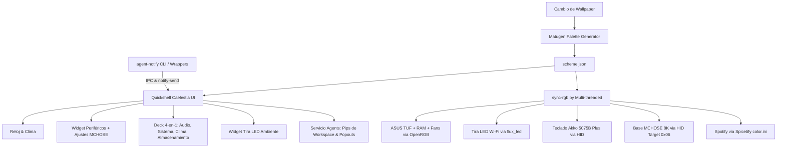

# Arquitectura General del Setup · LinuxRicing

Vista panorámica de la infraestructura del sistema (Arch / CachyOS + Hyprland + Quickshell Caelestia + Material You).

---

## 1. Componentes Principales

| Componente | Rol | Tecnologías |
|---|---|---|
| **Hyprland** | Compositor Wayland dinámico | C++, Lua (`hyprland.lua`), IPC socket |
| **Quickshell Caelestia** | Entorno de escritorio (Barra, Widgets, OSD, Dashboard) | QML, Qt Quick, JavaScript, Wayland Layer Shell |
| **Notificaciones de Agentes** | Estado visual persistente en pips de workspace, toasts ricos y popouts de detalle | Python (`agent-notify`), Quickshell QML (`services/Agents.qml`, `AgentBg.qml`, `AgentsPopout.qml`), Hyprland IPC |
| **Matugen** | Extracción dinámica de paletas Material You a partir de fondos | Rust, JSON (`~/.local/state/caelestia/scheme.json`) |
| **Spicetify** | Sincronización cromática en tiempo real de Spotify | CLI `spicetify apply`, temas CSS / `color.ini` |
| **OpenRGB** | Control de placa base ASUS TUF B560M-PLUS y RAM ENE DRAM | OpenRGB SDK (`localhost:6742`), SMBus / I2C |
| **MCHOSE Driver** | Telemetría de batería y control de iluminación HID | Python, `ioctl`, `hidraw`, XOR 0xFF |

---

## 2. Atajos Clave de Hyprland

- **`Super + W`**: Despliega el lanzador centrado prefiltrado en `>wallpaper ` con el **carrusel horizontal de fondos con miniaturas interactivas**.
- **`Super + Shift + W`**: Cambia a un fondo aleatorio instantáneamente.
- **`Super + Space`**: Lanzador de aplicaciones Caelestia.
- **`Super + Tab`**: Dashboard y centro de control.

---

## 3. Subsistema de Notificaciones de Agentes de IA

El rice integra un flujo continuo para agentes de desarrollo autónomo (Claude, Gemini, scripts largos):
- **CLI (`agent-notify`)**: Disparado al terminar una tarea o envolviendo la ejecución (`agent-notify run`). Captura repositorio, duración y ventana de Hyprland.
- **Servicio `Agents.qml` & UI**: Refleja el estado en el número de espacio de trabajo correspondiente de la barra (halo `AgentBg` y puntito de "sin ver"), despliega tarjetas en *hover* (`AgentsPopout`) y permite saltar al terminal con 1 clic mediante auto-descarte inteligente.
- Más detalles en: [[Notificaciones de Agentes]].

---

## 4. Sincronización de Archivos (Repo ↔ Sistema)

| Ámbito | Ruta Activa en el Sistema | Ruta en Git (`~/LinuxRicing/`) |
|---|---|---|
| **Quickshell Caelestia** | `~/.config/quickshell/caelestia/` | `configs/quickshell/caelestia/` |
| **Widgets de Escritorio** | `~/.config/quickshell/.../Background.qml` | `widgets/Background.qml` |
| **Scripts RGB** | `~/.local/bin/mchose-*`, `magichome-control` | `rgb/` |
| **CLI de Notificación de Agentes** | `~/.local/bin/agent-notify` | `rgb/agent-notify` |
| **Sincronizador Global (Linux)** | `~/.config/caelestia/sync-rgb.py` | `rgb/sync-rgb.py` |
| **Sincronizador Global (Windows)** | `C:\Users\Alberviz\LinuxRicing\rgb\` | `rgb/sync-rgb-windows.py` |
| **Bóveda Obsidian** | `~/LinuxRicing/vault/` | `vault/` |

> [!TIP]
> **Grafo Interactivo del Código (Code Graph):**
> Consulta el [[00 - Grafo de Arquitectura y Dependencias|🗺️ Grafo de Arquitectura y Dependencias]] y el lienzo visual interactivo `Mapa del Sistema.canvas` para ver el flujo exacto de llamadas entre componentes UI, daemons y drivers de hardware.

> Para la arquitectura equivalente en Windows, consultar [[Rice LinuxRicing/Windows - Arquitectura y Sincronización del Ecosistema|🪟 Windows · Arquitectura y Sincronización del Ecosistema]].

