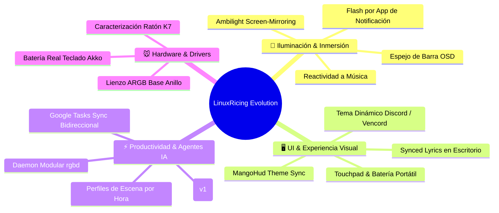

# 🔮 Roadmap Maestro de Innovaciones y Customizaciones

Visión a medio y largo plazo para convertir el setup **LinuxRicing** en uno de los entornos de escritorio más avanzados, estéticos y reactivos de Linux.

---

## 🌟 1. Iluminación Ambiente e Inmersión RGB

| Proyecto                                  | Descripción                                                                                                                                                                                | Dificultad | Impacto Visual |
| ----------------------------------------- | ------------------------------------------------------------------------------------------------------------------------------------------------------------------------------------------ | :--------: | :------------: |
| **Ambilight Screen-Mirroring**            | Captura continua a 10-15 FPS del borde superior de la pantalla mediante PipeWire/Grim y proyección del color promedio en la tira LED tras el monitor para películas y videojuegos.         |  🔴 Alta   |   🌟🌟🌟🌟🌟   |
| **Flashes de Notificación Inteligentes**  | La tira LED y el teclado emiten un destello del color de la app que envía la notificación (ej. Blurple para Discord, Verde para WhatsApp, Azul para Telegram, Rojo para alertas críticas). |  🟡 Media  |    🌟🌟🌟🌟    |
| **Espejo de Barra OSD (Volumen/Brillo)**  | Al subir o bajar el volumen con las teclas multimedia, la base MCHOSE o la tira LED dibuja un pulso o barra de color proporcional de 1 segundo.                                            |  🟡 Media  |    🌟🌟🌟🌟    |
| **Modo Cine / Pantalla Completa**         | Detección de ventana maximizada de vídeo (MPV, YouTube, Netflix): atenúa o apaga automáticamente la iluminación general para maximizar el contraste.                                       |  🟢 Baja   |     🌟🌟🌟     |
| **Iluminación Circadiana / Hora del Día** | De día tonos vivos y energéticos; a partir del atardecer pasa a tonos ámbar cálidos sincronizados con el modo noche (`gammastep`).                                                         |  🟢 Baja   |     🌟🌟🌟     |

---

## 🎵 2. Música, Multimedia y Visuales

| Proyecto                                              | Descripción                                                                                                                                                                 | Dificultad |  Impacto   |
| ----------------------------------------------------- | --------------------------------------------------------------------------------------------------------------------------------------------------------------------------- | :--------: | :--------: |
| **Overlay de Letras Sincronizadas (*Synced Lyrics*)** | Mostrar las letras de la canción en reproducción en tiempo real sobre el visualizador orbital del escritorio usando backend con LRCLIB / Spotify API.                       |  🟡 Media  | 🌟🌟🌟🌟🌟 |
| **Paleta Reactiva por Carátula**                      | En lugar de basarse siempre en el fondo de pantalla, opción de que todo el setup adopte dinámicamente los colores dominantes del álbum musical que esté sonando en Spotify. |  🟡 Media  |  🌟🌟🌟🌟  |
| **Pulsación Rítmica CAVA en Tira LED**                | Conectar el backend de CAVA para modular sutilmente el brillo de la tira al ritmo de los graves de la música.                                                               |  🟡 Media  |  🌟🌟🌟🌟  |

---

## 🎮 3. Integración de Gaming y Aplicaciones Externas

| Proyecto | Descripción | Dificultad | Impacto |
|---|---|:---:|:---:|
| **MangoHud & Gamescope Dynamic Styling** | Inyectar la paleta Material You activa en `~/.config/MangoHud/MangoHud.conf` para que el overlay de FPS, temperaturas y GPU en juegos combine con el escritorio. | 🟢 Baja | 🌟🌟🌟 |
| **Discord (Vencord) & Browser Theme Sync** | Generación automática de CSS dinámico en `~/.config/Vencord/themes/material-you.theme.css` y extensión de navegador para que Discord y Firefox adopten los colores del wallpaper. | 🟢 Baja | 🌟🌟🌟🌟 |
| **GameMode Activator** | Al lanzar juegos (Steam / Heroic), apagar widgets pesados de escritorio, liberar VRAM y fijar luces en modo concentración deportiva. | 🟢 Baja | 🌟🌟🌟 |

---

## ⚡ 4. Productividad, Agentes de IA y Automatización

| Proyecto | Descripción | Dificultad | Impacto | Estado |
|---|---|:---:|:---:|:---:|
| **Notificaciones de Agentes en Workspace (v1)** | Integración de `agent-notify`, toasts enriquecidos, halos en pips de workspace, popouts informativos y auto-descarte inteligente. | 🟡 Media | 🌟🌟🌟🌟 | 🟢 Hecho (v1) |
| **Indicador «En Curso» para Agentes (v2)** | Aro palpitante o respiración luminosa en el pip mientras el agente está trabajando en el terminal, antes de finalizar. | 🟡 Media | 🌟🌟🌟🌟 | 🔵 Planificado |
| **Google Tasks Sync Bidireccional** | Sincronización en segundo plano con Google Tasks para mostrar tareas pendientes en el Deck de widgets. | 🟡 Media | 🌟🌟🌟 | 🔵 Planificado |
| **Daemon Modular de Iluminación (`rgbd`)** | Unificar drivers HID/OpenRGB/Wi-Fi en un servicio daemon C++/Python modular y asíncrono. | 🔴 Alta | 🌟🌟🌟🌟🌟 | 🔵 Planificado |
| **Perfiles de Escena por Hora / Contexto** | Cambiar paleta, widgets activos e iluminación según la hora del día o actividad del usuario. | 🟢 Baja | 🌟🌟🌟 | 🔵 Planificado |

---

## 💻 5. Adaptabilidad para Portátiles y Movilidad

| Proyecto | Descripción | Dificultad | Impacto |
|---|---|:---:|:---:|
| **Gestos Táctiles Avanzados (Touchpad)** | Deslizar 3 dedos para cambiar workspaces fluidamente, 3 dedos arriba para abrir el launcher de Caelestia, pellizcar para vista general. | 🟢 Baja | 🌟🌟🌟🌟 |
| **Power Profile Switching** | Detección de estado de batería en portátiles: reducción automática de refresco de pantalla a 60Hz, desactivación de efectos de luz y optimización con `auto-cpufreq`. | 🟢 Baja | 🌟🌟🌟 |

---

## 🔬 6. Hardware pendiente de Ingeniería Inversa

1. **Iluminación del Cuerpo del Ratón MCHOSE K7 Ultra**:
   - Descifrar el comando para controlar el LED del cuerpo del ratón de forma independiente a la base.
2. **Telemetría de Batería Real del Teclado Akko**:
   - Actualmente es un valor estático; descifrar el Feature Report de batería real por USB/2.4G.
3. **Escenas de 1 Clic**:
   - Botones rápidos para perfiles: *"Gaming"*, *"Trabajo"*, *"Cine"*, *"Descanso"*, *"Apagado Total"*.

