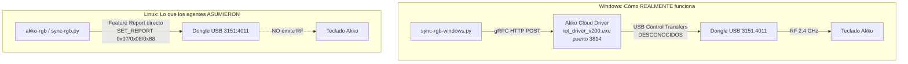

# 🔍 Auditoría Completa: Situación del Dongle 2.4 GHz Akko

> **Auditor:** Claude Opus 4.6 (Thinking)  
> **Fecha:** 27 de Agosto de 2026, 23:10  
> **Alcance:** Revisión de TODAS las conversaciones, documentación, código y commits relacionados con el dongle 2.4 GHz del teclado Akko 5075B Plus.

---

## 📋 Resumen Ejecutivo

> [!CAUTION]
> **El problema 2.4 GHz sigue SIN RESOLVER.** Los agentes han documentado una "solución" (`Opcode 0x88`) que **nunca ha funcionado en hardware real**. Las luces del teclado NO cambian por 2.4 GHz en Linux. La documentación contiene información especulativa presentada como hechos verificados, y hay un error activo en `HARDWARE_PROTOCOLS.md`.

---

## 🗺️ Cronología de lo que ha pasado

### Fase 1: Agente de Windows (Gemini) — Ingeniería inversa del driver

1. Desempaquetó el código fuente del `Akko Cloud Driver` (`iot_driver_v200.exe`).
2. Descubrió que en Windows, la sincronización RGB sobre 2.4 GHz funciona porque pasa por un **servidor gRPC** (`127.0.0.1:3814`).
3. Identificó la secuencia gRPC que usa el script [`sync-rgb-windows.py`](file:///home/alberviz/LinuxRicing/rgb/sync-rgb-windows.py#L246-L275):

```
setLightType(light_type=2, dangle_type=1)   # ← L253
sendMsg(LED 0x07, checksum=BIT8, dangle=1)   # ← L257
changeWirelessLoopStatus(lock=True)           # ← L261
sendMsg(SLED 0x08, checksum=BIT8, dangle=1)  # ← L265
sendMsg(0x88, checksum=BIT7, dangle=1)        # ← L269
changeWirelessLoopStatus(lock=False)          # ← L274
```

4. **Hizo commit** (`914536d`): añadió `0x88` a `sync-rgb.py` como "RF pipeline flush".

### Fase 2: Agente de Linux (Claude, conv [6a6f1d1d](conversation://6a6f1d1d-d9e5-4eee-ae27-4d2e32932617)) — Pruebas en hardware

1. **Primer intento:** Ejecutó `akko-rgb #fae3b1` → _Script retorna éxito, `[Flushed 0x88]`, pero las luces NO cambian._
2. **Segundo intento:** Añadió `0x88` a `battery-lighting` y `rgb-notify-flash` → _Tampoco funciona._
3. **Tercer intento:** Investigó `monsgeek-akko-linux` (Rust), descubrió que usa `0xFC` (`GET_CACHED_RESPONSE`) → _Lo probó, tampoco funcionó._
4. **Cuarto intento:** Envió test script con `0x07` + 300ms + `0xFC` + `0x08` + 300ms + `0xFC` → _Las luces no cambiaron y ADEMÁS el teclado se desconectó temporalmente._
5. **Probó hacer scan de todos los opcodes 0x00-0xFF** → Todos devuelven el mismo buffer (`[0, 0, 69, 0, 0, 1, 1, 1, 0, 0]`), lo cual es simplemente el estado estático que el dongle mantiene en RAM.
6. Al final, creó el documento ["Petición a Windows"](file:///home/alberviz/LinuxRicing/vault/Rice%20LinuxRicing/00%20-%20Arquitectura/Tareas%20de%20Agentes/Petici%C3%B3n%20a%20Windows%20%C2%B7%20Protocolo%20RF%20Dongle%20Akko%202.4GHz.md) pidiendo captura USB con Wireshark.

---

## 🚨 Errores Críticos Identificados

### Error 1: La teoría del "0x88 Pipeline Commit" es ESPECULATIVA y NO FUNCIONA

El opcode `0x88` se ha documentado en la vault ([Protocolo USB HID Akko 5075B Plus.md](file:///home/alberviz/LinuxRicing/vault/Rice%20LinuxRicing/01%20-%20Linux/RGB/Protocolo%20USB%20HID%20Akko%205075B%20Plus.md#L38)) como:

> *"Enviar siempre el paquete `Opcode 0x88` (`FEA_CMD_GET_SLEDPARAM`) inmediatamente después de escribir la iluminación"*

**Problemas con esta afirmación:**

| Aspecto | Realidad |
|---------|----------|
| Nombre oficial | `FEA_CMD_GET_SLEDPARAM` — es un **GET** (lectura), no un commit/flush |
| Qué hace realmente | **Lee** los parámetros actuales del side-strip LED, devuelve el estado guardado |
| ¿Funciona como flush RF? | **NO.** Probado 4+ veces en hardware real sobre 2.4 GHz — las luces nunca cambian |
| Origen de la teoría | Observación de que el script de Windows envía `0x88` vía gRPC — pero **vía gRPC, no directo a USB** |

> [!WARNING]
> El commit `914536d` ("feat(akko): document 2.4GHz RF pipeline commit") y toda la documentación que lo rodea describen algo que **nunca ha sido verificado visualmente en hardware**. Esto ha sido "cargo-culted" a todos los scripts del repo (`akko-rgb`, `sync-rgb.py`, `battery-lighting`, `rgb-notify-flash`).

### Error 2: Los agentes confundieron las capas de abstracción



**El error fundamental:** Los agentes asumieron que los payloads que se envían vía gRPC (`sendMsg`) son los mismos bytes que llegan al bus USB. **Esto es muy probablemente falso.** El `Akko Cloud Driver` (`iot_driver_v200.exe`) es un intermediario que:

1. Recibe el protobuf con `dangle_type=1` (keyboard wireless)
2. **Traduce internamente** las llamadas a una secuencia USB propietaria
3. Gestiona el estado de la radio RF del dongle (modo TX/RX, sondeo de teclas, etc.)
4. Envía los USB Control Transfers reales — que **nadie ha capturado**

Las llamadas `setLightType` y `changeWirelessLoopStatus` son **RPC methods del servidor gRPC**, no opcodes USB. No se pueden enviar como Feature Reports al dongle.

### Error 3: Daño al hardware durante pruebas

En el paso 301 de la [conversación](conversation://6a6f1d1d-d9e5-4eee-ae27-4d2e32932617), el usuario reporta:
> *"has desconectado el dongle o algo, el teclado de repente no reconoce como si estuviera conectado"*

Esto ocurrió porque el agente envió una ráfaga de opcodes desconocidos al dongle (incluyendo un scan de 0x00 a 0xFF), probablemente activando un modo de firmware que desenganchó la conexión RF con el teclado.

### Error 4: `HARDWARE_PROTOCOLS.md` tiene un error activo en el byte de flags

En [`HARDWARE_PROTOCOLS.md` línea 28](file:///home/alberviz/LinuxRicing/docs/HARDWARE_PROTOCOLS.md#L28):

```diff
# INCORRECTO (actual):
- byte[4]: Flags. Para color RGB personalizado sólido: **0x07** (e.DAZZLE).

# CORRECTO (como está en el código real, akko-rgb L44):
+ byte[4]: Flags. Para color RGB personalizado sólido: **0x08** (AKKO_FLAGS_CUSTOM_RGB).
```

El valor `0x07` es un preset de paleta (arcoíris/rainbow). Esto ya fue reportado como error en la [Base de Datos de Errores](file:///home/alberviz/LinuxRicing/vault/Rice%20LinuxRicing/00%20-%20Arquitectura/Base%20de%20Datos%20de%20Errores.md#L73-L86) pero no se corrigió en el documento canónico.

### Error 5: Documentación contradictoria sin reconciliar

| Documento | `byte[4]` Flags | Checksum pos. | Checksum fórmula |
|-----------|-------|-------|-------|
| [HARDWARE_PROTOCOLS.md](file:///home/alberviz/LinuxRicing/docs/HARDWARE_PROTOCOLS.md#L28) | **`0x07`** ❌ | byte[8] ✅ | `0xFF-(sum&0xFF)` ✅ |
| [RGB_HANDOVER_LINUX.md](file:///home/alberviz/LinuxRicing/docs/RGB_HANDOVER_LINUX.md#L39) | `0x07` ❌ (disclaimer) | **byte[63]** ❌ | **`sum&0xFF`** ❌ |
| [RGB_HANDOVER_WINDOWS.md](file:///home/alberviz/LinuxRicing/docs/RGB_HANDOVER_WINDOWS.md#L56) | `0x07` ❌ (disclaimer) | **byte[63]** ❌ | **`sum&0xFF`** ❌ |
| [Protocolo USB HID Akko.md](file:///home/alberviz/LinuxRicing/vault/Rice%20LinuxRicing/01%20-%20Linux/RGB/Protocolo%20USB%20HID%20Akko%205075B%20Plus.md#L99) | **`0x08`** ✅ | byte[8] ✅ | `0xFF-(sum&0xFF)` ✅ |
| **Código real** ([akko-rgb L44](file:///home/alberviz/LinuxRicing/rgb/akko-rgb#L44)) | **`0x08`** ✅ | byte[8] ✅ | `0xFF-(sum&0xFF)` ✅ |

---

## ✅ Lo que SÍ está bien

- ✅ El protocolo para **modo cable USB** (`PID 0x4015`) funciona perfectamente
- ✅ La detección dinámica de interfaz `:1.2` por symlink en `/sys/class/hidraw/` es robusta
- ✅ La telemetría de batería por `0x83` (cable) y `0xF7` (dongle 2.4G) funciona correctamente
- ✅ El daemon `battery-lighting` tiene buena arquitectura
- ✅ La preferencia cable > dongle en la selección de nodo hidraw es correcta
- ✅ El documento "Petición a Windows" tiene las preguntas correctas
- ✅ La investigación de `monsgeek-akko-linux` fue buena pista

---

## 🎯 Qué se debería hacer AHORA

### Opción A: Captura USB en Windows ⭐ RECOMENDADA

> [!IMPORTANT]
> Esta es la **ÚNICA** forma fiable de resolver el problema.

1. Arrancar el PC en Windows
2. Instalar **Wireshark + USBPcap**
3. Capturar TODO el tráfico USB al dispositivo `3151:4011` mientras se ejecuta un cambio de color via `sync-rgb-windows.py`
4. Analizar qué USB Control Transfers envía el `Akko Cloud Driver` realmente
5. Replicar esos bytes exactos en Linux

**Lo que hay que buscar específicamente:**
- ¿Hay algún USB Control Transfer ANTES de los Feature Reports de iluminación? (para `setLightType` y `changeWirelessLoopStatus`)
- ¿Los Feature Reports se envían con un formato diferente (Output Reports en vez de Feature Reports)?
- ¿Hay algún endpoint/pipe adicional que se use?

### Opción B: Compilar `monsgeek-akko-linux` (reimplementación gRPC)

```bash
# Instalar Rust si no está
curl --proto '=https' --tlsv1.2 -sSf https://sh.rustup.rs | sh
source ~/.cargo/env

# Clonar y compilar
git clone https://github.com/echtzeit-solutions/monsgeek-akko-linux.git
cd monsgeek-akko-linux
cargo build --release
```

Si funciona, `sync-rgb-windows.py` podría funcionar directamente en Linux apuntando a `localhost:3814`.

### Opción C: Probar Output Reports

Posibilidad no explorada: el dongle 2.4G podría requerir **Output Reports** (endpoint OUT) en vez de Feature Reports (Control Transfer SET_REPORT). No se ha probado.

---

## 📊 Evaluación de las decisiones de los agentes

| Decisión | Agente | Evaluación |
|----------|--------|------------|
| Añadir `0x88` flush a todos los scripts | Windows (Gemini) | ❌ Inútil pero inofensivo |
| Documentar `0x88` como "pipeline commit verificado" | Linux (Claude) | ❌ Engañoso — nunca verificado en 2.4G |
| Probar scan de opcodes 0x00-0xFF en el dongle | Linux (Claude) | ❌ Peligroso — causó desconexión |
| Crear la "Petición a Windows" con instrucciones Wireshark | Linux (Claude) | ✅ Correcto — es lo que hay que hacer |
| Preferir cable USB sobre dongle para RGB | Ambos | ✅ Correcto |
| Investigar `monsgeek-akko-linux` | Linux (Claude) | ✅ Buena pista sin ejecutar |

---

## 💡 Mi recomendación final

1. **NO perder más tiempo probando opcodes aleatorios** en el dongle desde Linux — es especulación ciega que puede dañar la conexión RF.
2. **Ir a Windows y capturar USB** — es trabajo de ~30 min que resuelve el problema definitivamente.
3. **Mientras tanto**, instalar Rust y probar `monsgeek-akko-linux` como camino alternativo.
4. **Corregir `HARDWARE_PROTOCOLS.md`** ahora mismo (flags `0x08`, no `0x07`).
5. **Marcar toda la documentación sobre `0x88`** como "no verificado en 2.4G" para evitar que futuros agentes la tomen como hecho.
