# 📡 Coordinación Multi-Agente · Protocolo de Emisión RF Dongle Akko 2.4 GHz (`PID 0x4011`)

> [!IMPORTANT]
> **Mensaje para el Agente de Windows (Gemini):**
> Este documento detalla la causa raíz de por qué la iluminación del teclado Akko 5075B Plus funciona en Windows sobre 2.4 GHz pero falla en Linux, y define las tareas específicas de captura y análisis USB que necesitamos que realices en el entorno Windows.

---

## 🎯 1. Resumen de la Situación y Diagnóstico

```mermaid
graph TD
    subgraph Windows_Setup["🪟 Windows (100% Operativo)"]
        WinScript[sync-rgb-windows.py] -->|HTTP / gRPC localhost:3814| AkkoDriver[Akko Cloud Driver Service]
        AkkoDriver -->|Secuencia de Control Propietaria| WinDongle[Dongle 2.4G USB 3151:4011]
        WinDongle -->|📡 Emisión RF por el aire| WinKB[Teclado Akko 5075B: CAMBIA COLOR]
    end

    subgraph Linux_Setup["🐧 Linux (Bloqueado en 2.4 GHz)"]
        LinScript[sync-rgb.py / akko-rgb] -->|ioctl HIDIOCSFEATURE crudo| LinDongle[Dongle 2.4G USB 3151:4011 /dev/hidraw3]
        LinDongle -->|❌ Retenido en buffer interno / Sin RF| LinStalled[No transmite al aire]
        LinStalled -.->|Falta Secuencia de Control| LinKB[Teclado Akko 5075B: NO CAMBIA]
    end
```

### 🔍 ¿Qué está pasando exactamente?

1. **En Windows:**
   - En [`rgb/sync-rgb-windows.py`](file:///home/alberviz/LinuxRicing/rgb/sync-rgb-windows.py), el cambio de color y telemetría sobre 2.4 GHz tiene éxito porque el script se comunica vía gRPC (`http://127.0.0.1:3814/driver.DriverGrpc/sendMsg`) con el servicio oficial en segundo plano **`Akko Cloud Driver`**.
   - El driver de Windows ejecuta métodos RPC propietarios antes de escribir los colores:
     - `setLightType(light_type=2, dangle_type=1)`
     - `sendMsg(..., dangle_type=1)` (Opcode `0x07` Teclas)
     - `changeWirelessLoopStatus(lock=True)`
     - `sendMsg(..., dangle_type=1)` (Opcode `0x08` Lateral)
     - `sendMsg(..., dangle_type=1)` (Opcode `0x88` Flush)
     - `changeWirelessLoopStatus(lock=False)`

2. **En Linux:**
   - En Linux **no disponemos del ejecutable ni del servicio `Akko Cloud Driver`**.
   - Cuando Linux envía los Feature Reports directos (`0x07` y `0x08` con `Flags = 0x08` y checksums Bit8) a `/dev/hidraw` en la interfaz `:1.2`:
     - El kernel de Linux realiza el USB Control Transfer `SET_REPORT` con éxito (código 0).
     - El dongle USB físico acepta el paquete en su SRAM interna.
     - **Pero el dongle NO conmuta su transceptor de radio (RF) a modo transmisión (TX)** y continúa en bucle infinito de recepción de pulsaciones (RX polling), por lo que **el teclado físico nunca recibe la orden por el aire**.
   - Al consultar el estado del dongle mediante `0xF7` (`GET_DONGLE_STATUS`), el dongle confirma que está vivo y reporta telemetría (`Batería 69%`, `RF Ready: 1`), pero el buffer de salida no se transmite sin la orden de control previa.

---

## 🛠️ 2. Qué necesitamos del Agente de Windows

Dado que tú tienes acceso directo al sistema Windows donde el software oficial de Akko está instalado y operativo, necesitamos que realices **una de las siguientes tareas**:

### 🎯 Tarea Principal: Captura USB (Wireshark / USBPcap) en Windows

Necesitamos conocer **cuáles son los bytes USB crudos exactos** que el `Akko Cloud Driver` envía al dongle `3151:4011` a través del bus USB cuando se llama a `setLightType`, `sendMsg(dangle_type=1)` y `changeWirelessLoopStatus`.

#### Pasos para el agente de Windows:
1. Conectar el teclado exclusivamente por el Dongle 2.4 GHz (`PID 0x4011`).
2. Iniciar una captura en **Wireshark** sobre la interfaz **`USBPcap`** del concentrador USB donde está conectado el dongle.
3. Filtrar por el dispositivo USB: `usb.idVendor == 0x3151 && usb.idProduct == 0x4011`.
4. Ejecutar el cambio de color con `python rgb/sync-rgb-windows.py`.
5. Detener la captura y guardar el archivo en el repositorio como:
   `docs/pcap/akko_2.4g_color_change.pcapng` (o documentar los paquetes en un markdown).
6. **Extraer y documentar en Obsidian:**
   - ¿Qué Report ID / Setup Packet / Control Request envía para `setLightType`?
   - ¿Qué bytes preceden a los reportes `0x07` y `0x08` para que el dongle sepa que el destinatario es `dangle_type = 1` (el teclado por RF)?
   - ¿Qué envía exactamente `changeWirelessLoopStatus(lock=True)` y `(lock=False)` a nivel de USB Feature Report o Control Transfer?

---

## 💡 3. Alternativa: Investigar el Servidor gRPC de Akko

Si realizar la captura USB resulta complejo:
1. **Analizar la arquitectura del driver:** ¿El servicio de Windows en el puerto `3814` es un binario independiente (ej. `DriverService.exe` / NodeJS / Go / Rust / Electron)?
2. **Reutilización o portabilidad:** Si el backend es un ejecutable portátil o un servidor gRPC compilable, podríamos ejecutarlo como un micro-demonio local en Linux o emular su interfaz con el proyecto comunitario de código abierto [`monsgeek-akko-linux`](https://github.com/echtzeit-solutions/monsgeek-akko-linux), que reimplementa en Rust el servidor gRPC oficial de Akko para Linux.

---

## 📋 4. Estado Actual en Linux (Listo para Integración)

En Linux ya tenemos completamente preparados y validados:
- ✅ Identificación dinámica de la interfaz `:1.2` (`/dev/hidraw*`) sin hardcodear números de nodo.
- ✅ Checksum Bit8 (`0xFF - (sum(bytes[0..8]) & 0xFF)`) en el byte 8 para `SET_LEDPARAM` (`0x07`) y `SET_SLEDPARAM` (`0x08`).
- ✅ Modos de iluminación: estático (`0x01`), respiración (`0x02`), flujo reactivo (`0x05`) y matriz tecla a tecla (`0x0D` + `0x0C`).
- ✅ Soporte por cable directo USB (`PID 0x4015`): **100% probado y funcionando**.

Tan pronto como el agente de Windows nos proporcione la cabecera USB / secuencia de encapsulación de radiofrecuencia para el dongle `PID 0x4011`, la implementaremos en `rgb/sync-rgb.py`, `rgb/battery-lighting` y `rgb/akko-rgb` para tener paridad total en ambos sistemas operativos.
