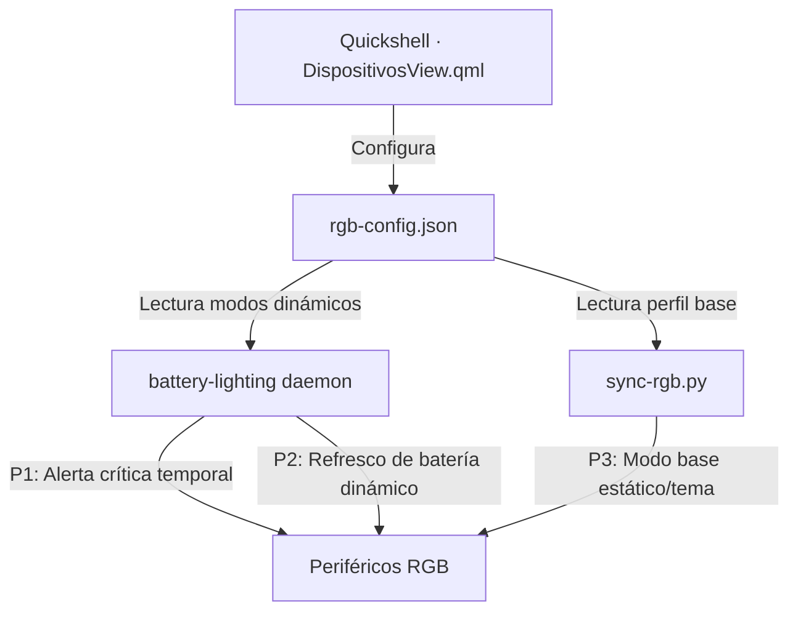

# 🎮 Perfiles y Modos de Iluminación por Dispositivo

Este documento detalla el funcionamiento del sistema de **perfiles de iluminación por dispositivo**, accesible desde la pestaña **Dispositivos** del Centro de Control RGB (`Super + Tab` o menú de control).

---

## 1. Arquitectura y Jerarquía

Cada periférico o subsistema RGB cuenta con su propio perfil independiente guardado en `~/.config/caelestia/rgb-config.json` bajo la clave `device_profiles`.

### Jerarquía de Prioridad:
1. **P1 · Alerta Activa de Batería (Temporal):** Definida en *Notificaciones → Reacciones de Batería*. Si el ratón o teclado entran en batería baja/crítica, la alerta sobreescribe temporalmente la zona asignada.
2. **P2 · Modo Base por Dispositivo:** El modo configurado en la tarjeta del dispositivo (ej. medidor de batería tecla a tecla, color de batería, color fijo, flujo o respiración).
3. **P3 · Modo Global:** Sigue el color del tema dinámico extraído del fondo de pantalla.

---

## 2. Opciones por Dispositivo

### A. Teclado Akko 5075B Plus
- **Teclas (LED Backlight):**
  - `Tema global`: Color del tema Material You del sistema.
  - `Color fijo`: Color personalizado independiente mediante selector cromático.
  - `Nivel de batería`: Color dinámico según % de carga (Verde → Lima → Amarillo → Ámbar → Rojo).
  - `Letra a letra`: Medidor progresivo tecla por tecla que se apaga progresivamente al descargarse y se llena al cargar.
  - `Fila a fila`: Medidor en 5 alturas por filas de teclas.
  - `Respiración (batería)`: Efecto de respiración monocolor con el tono de la batería.
  - `Respiración (tema)`: Efecto de respiración con el color del tema.
  - `Reactivo al pulsar`: Las teclas se iluminan al teclear (`LightPressAction`).
- **Tira Lateral (Side-Strip SLED):**
  - `Flujo batería`: Snake stream (`0x05`) en degradado de batería a velocidad mínima.
  - `Tema global`: Color estático del tema.
  - `Color fijo`: Color personalizado para la tira.
  - `Nivel de batería`: Color estático según %.
  - `Respiración (batería)`: Respiración en color de batería.
  - `Apagada`: Tira lateral apagada.

### B. Base MCHOSE 8K (Anillo LED)
- `Tema global`: Color estático del tema.
- `Color fijo`: Color personalizado.
- `Nivel de batería`: Color estático según la batería del ratón K7 Ultra.
- `Respiración (tema)`: Efecto respiración con el color del tema.
- `Ola de colores`: Efecto espectral dinámico.

### C. Placa Base, Memorias RAM y Ventiladores (OpenRGB)
- `Tema global`: Color estático en placa base y RAM.
- `Color fijo`: Color fijo personalizado.
- `ARGB ola animada`: Activa el daemon `argb-wave.service` en ventiladores direccionables.
- `Nivel de batería`: Color según la batería de los periféricos.

### D. Tira LED MagicHome (Wi-Fi)
- `Tema global`: Sigue el color del tema.
- `Color fijo`: Color fijo independiente.
- `Nivel de batería`: Sigue el nivel de batería del teclado/ratón.

---

## 3. Cadencia de Actualización de Batería

En la parte inferior de la pestaña **Dispositivos** se incluye un control deslizante para ajustar la **cadencia de sondeo en reposo** (entre **15 y 120 segundos**, con valor por defecto de **60 s**).
Al conectar un periférico a cargar por cable o acoplar el ratón a la base, el sistema acelera automáticamente la cadencia a **3 segundos** para reflejar la carga en tiempo real.
