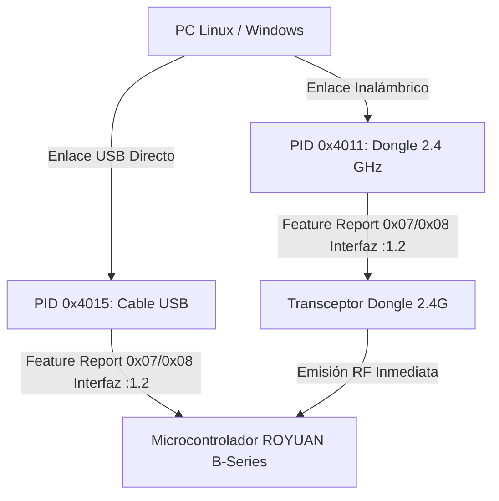

# ⌨️ Protocolo USB HID · Teclado Akko 5075B Plus (2.4 GHz & Cable)

Contexto histórico, manual de diagnóstico y notas de ingeniería inversa del teclado **Akko 5075B Plus** (controlador ROYUAN B-series) en entornos Linux y Windows.

> [!NOTE]
> **Especificación Canónica:** La especificación técnica completa y actualizada de opcodes, bytes y payloads se encuentra en [`hardware/akko-5075b-plus/PROTOCOL.md`](file:///C:/Users/Alberviz/LinuxRicing/hardware/akko-5075b-plus/PROTOCOL.md). Los hallazgos detallados de las capturas USB en 2.4 GHz están en [`hardware/akko-5075b-plus/USB_FINDINGS_2.4G.md`](file:///C:/Users/Alberviz/LinuxRicing/hardware/akko-5075b-plus/USB_FINDINGS_2.4G.md).



---

## 🔍 1. Identificadores de Hardware (VID / PID)

| Modo de Enlace | Vendor ID | Product ID | Dispositivo Físico Conectado al Puerto USB |
| :--- | :--- | :--- | :--- |
| **Cable USB Directo** | `0x3151` | **`0x4015`** | **La placa del teclado directamente.** |
| **Inalámbrico 2.4 GHz** | `0x3151` | **`0x4011`** | **El Dongle transceptor de radio USB.** |

Ambos modos utilizan el mismo protocolo de Feature Reports sobre la interfaz `:1.2`.

---

## 🚨 2. Errores Típicos y Diagnóstico

### 🔴 Error 1: El mito del "Commit 0x88 / RF Pipeline Flush" (Refutado)
* **Historia / Error:** Durante las primeras pruebas se creía que el dongle 2.4 GHz requería un paquete adicional con `Opcode 0x88` (`FEA_CMD_GET_SLEDPARAM`) para vaciar un supuesto buffer RF interno.
* **Realidad verificada por captura USB:** Las capturas USB con Wireshark/USBPcap demostraron que `0x88` es en realidad un comando de **lectura** de parámetros de la tira lateral, y que los comandos de iluminación estándar (`0x07` y `0x08`) se emiten de inmediato por radio sin necesidad de ningún flush. No se debe enviar `0x88` como comando de escritura.

---

### 🔴 Error 2: "Cambié el dongle de puerto USB y dejó de funcionar"
* **Causa Raíz:** 
  1. En Linux, al cambiar de puerto USB, el kernel reenumera los nodos `/dev/hidrawX` (ej. pasa de `hidraw2` a `hidraw7`).
  2. El dongle 2.4G expone **3 interfaces USB**:
     * `:1.0` -> Pulsaciones de teclas normales.
     * `:1.1` -> Teclas multimedia / Control de volumen.
     * **`:1.2` -> Interface 2: Exclusiva para control de iluminación y telemetría**.
  3. Si un script abre el primer `/dev/hidraw` que encuentra sin verificar que la ruta física contenga `:1.2`, el comando se envía a un endpoint erróneo y el kernel lo descarta silenciosamente.
* **Solución:** Escaneo dinámico obligatorio por descriptor `uevent` y symlink `:1.2`:
  ```python
  import glob, os

  def find_akko_hidraw():
      for h in sorted(glob.glob("/sys/class/hidraw/hidraw*")):
          uevent = f"{h}/device/uevent"
          if not os.path.exists(uevent): continue
          content = open(uevent).read()
          if "3151" in content and (":1.2" in os.path.realpath(f"{h}/device")):
              return "/dev/" + os.path.basename(h)
      return None
  ```

---

### 🔴 Error 3: "Las teclas se quedan en modo arcoíris / multicolor y no aceptan color sólido"
* **Causa Raíz:**
  1. En el firmware ROYUAN B-series, el campo `Flags` (Byte 4) con valor `0x07` corresponde al preset de paleta #7 (Arcoíris/Rainbow).
  2. El modo **Custom RGB de 24 bits** requiere **`Flags = 0x08`** (`AKKO_FLAGS_CUSTOM_RGB = 0x08`).
  3. Si el teclado estaba previamente en modo Lienzo por tecla (`UserPicture` / Modo 13), ignora los paquetes de modo 1 hasta recibir un reseteo de modo o los 7 chunks de 56 bytes (`Opcode 0x0C`).
* **Solución:** Usar siempre `Flags = 0x08` y Modo `0x01` para color sólido. Ver detalles en [`hardware/akko-5075b-plus/PROTOCOL.md`](file:///C:/Users/Alberviz/LinuxRicing/hardware/akko-5075b-plus/PROTOCOL.md).

---

### 🔴 Error 4: Per-key dinámico en 2.4 GHz satura la radio
* **Hallazgo:** Intentar actualizar el mapa de LEDs por tecla (`Opcode 0x0C`, 7 paquetes) de forma dinámica (por ejemplo, animaciones continuas o gauge de batería en tiempo real) a través de la radio 2.4 GHz satura el canal y provoca congelaciones de ~0.5–1s en el teclado.
* **Solución:** En 2.4 GHz usar efectos per-key solo como estado estático; para animaciones reactivas en vivo usar la tira lateral (`0x08`) o conectar por cable USB.

---

## 📚 3. Referencia Técnica

Para la estructura exacta de los paquetes, checksum BIT7, modos y mapa de coordenadas per-key, consultar:
- [Protocolo Canónico Akko 5075B Plus](file:///C:/Users/Alberviz/LinuxRicing/hardware/akko-5075b-plus/PROTOCOL.md)
- [Capturas y Análisis USB 2.4G](file:///C:/Users/Alberviz/LinuxRicing/hardware/akko-5075b-plus/USB_FINDINGS_2.4G.md)
- [Frontend de Iluminación de Batería](file:///C:/Users/Alberviz/LinuxRicing/hardware/akko-5075b-plus/BATTERY_LIGHTING_FRONTEND.md)
