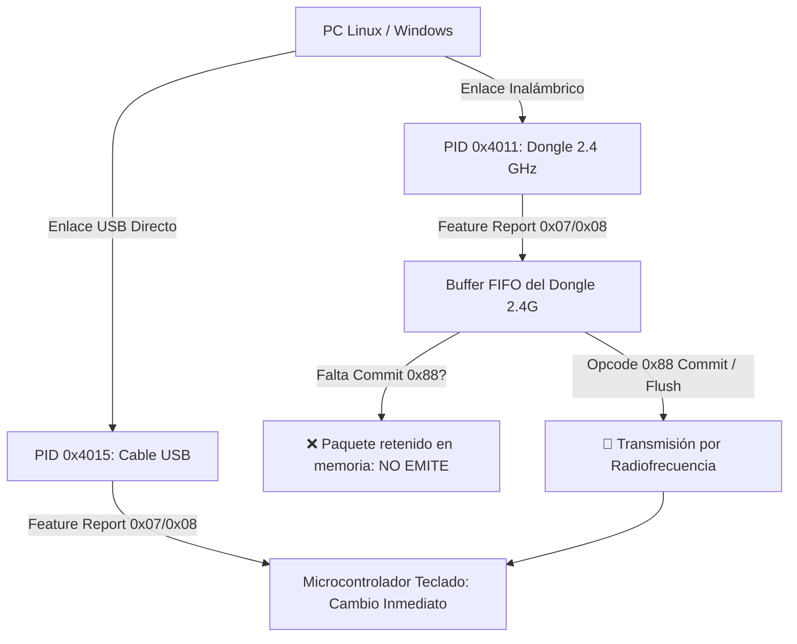

# ⌨️ Protocolo USB HID · Teclado Akko 5075B Plus (2.4 GHz & Cable)

Documentación técnica y manual de diagnóstico para la ingeniería inversa del teclado **Akko 5075B Plus** (controlador ROYUAN B-series) en entornos Linux y Windows.



---

## 🔍 1. Identificadores de Hardware (VID / PID)

| Modo de Enlace | Vendor ID | Product ID | Dispositivo Físico Conectado al Puerto USB |
| :--- | :--- | :--- | :--- |
| **Cable USB Directo** | `0x3151` | **`0x4015`** | **La placa del teclado directamente.** |
| **Inalámbrico 2.4 GHz** | `0x3151` | **`0x4011`** | **El Dongle transceptor de radio USB.** |

---

## 🚨 2. Por Qué Fallan los Agentes (Errores Típicos y Soluciones)

### 🔴 Error 1: "El script se ejecuta con código 0, pero las luces no cambian en 2.4 GHz"
* **Causa Raíz:** En modo 2.4 GHz (`PID 0x4011`), el microcontrolador del dongle retiene los comandos LED (`0x07` y `0x08`) en una cola interna. **No los emite por el aire** hasta que recibe un comando de sincronización/commit.
* **Solución:** Enviar siempre el paquete **`Opcode 0x88` (`FEA_CMD_GET_SLEDPARAM`)** inmediatamente después de escribir la iluminación:
  ```python
  # Pipeline Commit para forzar la emisión RF
  req_sync = bytearray(64)
  req_sync[0] = 0x88
  req_sync[7] = 0x77  # Checksum BIT7
  fcntl.ioctl(fd, HIDIOCSFEATURE(65), bytearray([0x00]) + req_sync)
  ```

---

### 🔴 Error 2: "Cambié el dongle de puerto USB y dejó de funcionar"
* **Causa Raíz:** 
  1. En Linux, al cambiar de puerto USB, el kernel reenumera los nodos `/dev/hidrawX` (ej. pasa de `hidraw2` a `hidraw7`).
  2. El dongle 2.4G expone **3 interfaces USB**:
     * `:1.0` -> Pulsaciones de teclas normales.
     * `:1.1` -> Teclas multimedia / Control de volumen.
     * **`:1.2` -> Interface 2: Exclusiva para control de iluminación y telemetría**.
  3. Si un script abre el primer `/dev/hidraw` que encuentra sin verificar que la ruta física contenga `:1.2`, el comando se envía a un endpoint erróneo y el kernel lo descarta silenciosamente.
* **Solución:** Escaneo dinámico obligatorio por descriptor `uevent` y symlink `:1.2`:
  ```python
  import glob, os

  def find_akko_hidraw():
      for h in sorted(glob.glob("/sys/class/hidraw/hidraw*")):
          uevent = f"{h}/device/uevent"
          if not os.path.exists(uevent): continue
          content = open(uevent).read()
          if "3151" in content and (":1.2" in os.path.realpath(f"{h}/device")):
              return "/dev/" + os.path.basename(h)
      return None
  ```

---

### 🔴 Error 3: "Las teclas se quedan en modo arcoíris / multicolor y no aceptan color sólido"
* **Causa Raíz:**
  1. En el firmware ROYUAN B-series, el campo `Flags` (Byte 4) con valor `0x07` corresponde al preset de paleta #7 (Arcoíris/Rainbow).
  2. El modo **Custom RGB de 24 bits** requiere **`Flags = 0x08`** (`AKKO_FLAGS_CUSTOM_RGB = 0x08`).
  3. Si el teclado estaba previamente en modo Lienzo por tecla (`UserPicture` / Modo 13), ignora los paquetes de modo 1 hasta recibir un reseteo de modo o los 7 chunks de 56 bytes (`Opcode 0x0C`).
* **Solución:** Usar siempre `Flags = 0x08` y Modo `0x01` para color sólido:
  ```python
  led = bytearray(64)
  led[0] = 0x07                 # Opcode Backlight
  led[1] = 0x01                 # Mode 1 (Always On / Solid)
  led[2] = 0x04                 # Velocidad
  led[3] = 0x04                 # Brillo 100%
  led[4] = 0x08                 # FLAGS = 0x08 (Custom RGB directo)
  led[5], led[6], led[7] = r, g, b
  led[8] = 0xFF - (sum(led[:8]) & 0xFF)  # Checksum BIT7 en byte 8
  ```

---

## 🛠️ 3. Especificación Técnica de Paquetes

### A. Retroiluminación Principal de Teclas (Opcode `0x07`)
* `byte[0]`: `0x07`
* `byte[1]`: Modo (`0x01` Fijo, `0x02` Respiración, `0x05` Ripple, `0x0D` UserPicture)
* `byte[2]`: Velocidad (`0..4` invertido como `4 - speed`)
* `byte[3]`: Brillo (`0..4`, `4` = 100%)
* `byte[4]`: **`0x08` (Custom RGB)**
* `byte[5..7]`: `R, G, B` (`0 - 255`)
* `byte[8]`: Checksum BIT7 = `0xFF - (sum(byte[0..8]) & 0xFF)`

### B. Barra Lateral SLED (Opcode `0x08`)
* `byte[0]`: `0x08`
* `byte[1]`: Modo (`0x01` Fijo, `0x02` Respiración, `0x05` Steady Stream / Flujo continuo)
* `byte[2]`: Velocidad (`0..4`, `0` = ultracalmada para carga)
* `byte[3]`: Brillo (`0..4`, `4` = 100%)
* `byte[4]`: **`0x08` (Custom RGB)**
* `byte[5..7]`: `R, G, B`
* `byte[8]`: Checksum BIT7

### C. Telemetría de Batería y Carga (Opcode `0x83`)
* **Solicitud:** Buffer de 64 bytes con `byte[0] = 0x83`, `byte[7] = 0x7C`.
* **Respuesta:**
  * `byte[1]`: **Porcentaje de Batería** (`0 - 100%`).
  * `byte[2]`: **Estado de Carga** (`0x01` = `⚡ Cargando por USB`, `0x00` = `Descargando en 2.4G`).

---

## 🚀 4. Secuencia Completa de Referencia en Python (Linux hidraw)

```python
import os, fcntl, time

def set_akko_rgb(r, g, b, hidraw_node):
    fd = os.open(hidraw_node, os.O_RDWR | os.O_NONBLOCK)
    
    # 1. Backlight
    led = bytearray(64)
    led[0] = 0x07; led[1] = 0x01; led[2] = 0x04; led[3] = 0x04; led[4] = 0x08
    led[5], led[6], led[7] = r, g, b
    led[8] = 0xFF - (sum(led[:8]) & 0xFF)
    fcntl.ioctl(fd, (3 << 30) | (65 << 16) | (ord("H") << 8) | 0x06, bytearray([0x00]) + led)
    time.sleep(0.03)

    # 2. Side-Strip
    sled = bytearray(64)
    sled[0] = 0x08; sled[1] = 0x01; sled[2] = 0x04; sled[3] = 0x04; sled[4] = 0x08
    sled[5], sled[6], sled[7] = r, g, b
    sled[8] = 0xFF - (sum(sled[:8]) & 0xFF)
    fcntl.ioctl(fd, (3 << 30) | (65 << 16) | (ord("H") << 8) | 0x06, bytearray([0x00]) + sled)
    time.sleep(0.03)

    # 3. Pipeline Commit (CRÍTICO PARA 2.4 GHz)
    commit = bytearray(64); commit[0] = 0x88; commit[7] = 0x77
    fcntl.ioctl(fd, (3 << 30) | (65 << 16) | (ord("H") << 8) | 0x06, bytearray([0x00]) + commit)
    time.sleep(0.02)
    
    os.close(fd)
```
