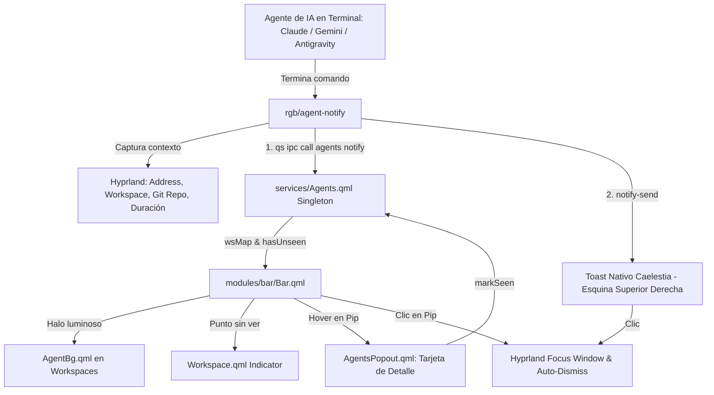

# 🤖 Notificaciones de Agentes en el Pip del Workspace

Documento de arquitectura y funcionamiento del subsistema de estado de agentes de IA integrado en la barra de Quickshell (Caelestia) y Hyprland.

---

## 🎯 1. Problema que Resuelve

Cuando un agente de IA termina una tarea en segundo plano en un terminal, el sistema tradicional de notificaciones presenta tres deficiencias críticas:

1. **Cero Contexto:** Notificaciones genéricas tipo *"Claude ha terminado"* sin indicar qué repositorio, qué comando se ejecutó, cuánto tiempo tomó ni en qué espacio de trabajo se encuentra la ventana.
2. **Fugacidad:** El toast emergente expira en 5 segundos y desaparece; si el usuario está mirando otra pantalla o alejado del escritorio, la información se pierde sin dejar rastro.
3. **Sin Vuelta Atrás:** No existía un mecanismo directo para hacer clic en el aviso y saltar inmediatamente a la ventana o workspace exacto donde se encuentra el terminal del agente.

### 🚫 El Intento Anterior (Lección Aprendida)
Un intento previo intentó colocar una «píldora persistente» dentro del cajón lateral de notificaciones (`AgentPills.qml`). Esto colisionó directamente con la arquitectura gráfica de Caelestia:
- **`BlobGroup` (metabolas SDF):** El fondo oscuro compartido no permitía rectángulos redondeados pequeños aislados.
- **`ClippingRectangle` por ítem:** Recortaba los elementos compactos a los bordes de la lista.
- **Anclaje `notifications.bottom → sidebar.top`:** Empujaba la barra lateral hacia abajo de forma permanente.
- **Filosofía de `Notifs`:** Las notificaciones están diseñadas para desaparecer (`popups.filter(n => !n.closed)`).

*(Para más detalles técnicos de este fallo, consultar [[Base de Datos de Errores#La "píldora persistente" de agente rompía el cajón de notificaciones de Caelestia|Base de Datos de Errores]]). Revertido en `e6569fc`.*

---

## 💡 2. Arquitectura de la Solución (Pip del Workspace)

En lugar de forzar elementos permanentes en el cajón de notificaciones efímeras, el estado persistente vive directamente en el **pip numérico del workspace** en la barra superior/lateral de Caelestia.

### Estados Visuales del Pip:

| Estado | Aspecto Visual | Significado |
|---|---|---|
| **Normal (Vacío)** | Número tenue (`m3outlineVariant`) | Workspace sin ventanas activas. |
| **Ocupado / Activo** | Fondo `OccupiedBg` / `m3onSurface` | Workspace con ventanas abiertas o enfocado. |
| **Agente Completado (No visto)** | **Halo de acento (`AgentBg`) + Puntito interior** | Un agente terminó una tarea en este workspace y el usuario aún no ha inspeccionado el detalle. El texto vira a `m3onPrimaryContainer`. |
| **Agente Completado (Visto)** | **Halo de acento (`AgentBg`) sin puntito** | El usuario ya hizo *hover* sobre el pip y vio la tarjeta de detalle, pero aún no ha entrado al terminal. |

---

## 🔄 3. Flujo de Datos y Ciclo de Vida

1. **Ejecución y Captura:**
   - El agente corre envuelto con `agent-notify run -n Claude -t "Refactor QML" -- ...` (o se invoca directamente `agent-notify notify`).
   - `agent-notify` detecta vía `hyprctl activewindow -j` la dirección hexadecimal de la ventana (`address`), el espacio de trabajo (`ws`), la clase de terminal (`kitty`, `foot`, etc.), el nombre del proyecto Git (`git rev-parse --show-toplevel`) y la duración.
2. **Emisión Dual:**
   - **IPC a Quickshell:** `qs -c caelestia ipc call agents notify <json>` registra la entrada en `services/Agents.qml` (`seen: false`).
   - **Toast de Escritorio:** `notify-send -a caelestia-agents -h string:address:0x...` dispara un popup rico arriba a la derecha.
3. **Reacción en la Barra:**
   - El singleton `Agents.qml` recalcula `wsMap`.
   - `AgentBg.qml` dibuja un halo suave con desenfoque (`MultiEffect.blur`) detrás del pip del workspace.
   - `Workspace.qml` activa el punto interior de 4 px (`agentUnseen: true`).
4. **Inspección (Hover):**
   - El usuario pasa el cursor sobre el pip.
   - `Bar.qml::checkPopout` detecta el workspace vía `Workspaces.wsAt(y)` y activa `popouts.currentName = "agents"`.
   - `AgentsPopout.qml` renderiza una tarjeta flotante con: icono `smart_toy`, nombre del agente, descripción de la tarea, tiempo relativo (*«hace X min»*), duración y chip de estado.
   - Se invoca `Agents.markSeen(ws)`: el puntito desaparece suavemente; el halo permanece.
5. **Navegación y Auto-Descarte:**
   - **Vía Clic:** Al hacer clic en el pip del workspace o en el toast nativo, Hyprland enfoca la ventana (`focuswindow address:0x...`).
   - **Auto-Descarte por Foco:** Al activarse la ventana (`onActiveToplevelChanged`), `Agents.dismissByAddress()` elimina la entrada y apaga el halo.
   - **Auto-Descarte por Ventana Cerrada:** Si la ventana se cerró al terminar, al entrar al workspace (`onFocusedWorkspaceChanged`), el sistema detecta que la ventana ya no existe en `Hyprland.toplevels` y limpia el halo.

---

## 🧩 4. Piezas del Subsistema

### 1. `rgb/agent-notify` (CLI Python)
- Ubicación instalada: `~/.local/bin/agent-notify`.
- Comandos soportados: `run` (wrapper con medición de tiempo), `notify` (disparo manual), `test` (prueba en workspace activo real), `clear` (limpieza global).
- Desacoplado: solo usa librerías estándar de Python (`argparse`, `subprocess`, `json`, `time`, `pathlib`).

### 2. `services/Agents.qml` (Singleton de Estado)
- Fuente de verdad de los agentes completados (`completedAgents`).
- Normaliza direcciones hexadecimales (`0x...` vs `...`).
- `liveWs(address, fallbackWs)`: Resuelve dinámicamente el workspace actual de la ventana consultando `Hyprland.toplevels.values`, garantizando que si la ventana es movida de workspace, el halo la acompañe.
- Deduplica por ventana: una nueva tarea en el mismo terminal reemplaza la entrada previa.

### 3. `modules/bar/components/workspaces/AgentBg.qml` (Capa de Halo)
- Hermano de `OccupiedBg.qml`. Instanciado dentro del `StyledClippingRect` de `Workspaces.qml`.
- Renderiza un `StyledRect` con `Tokens.rounding.full`, color `Colours.palette.m3primary`, opacidad 0.22 y `MultiEffect` con `blur: 0.6`.

### 4. `modules/bar/popouts/AgentsPopout.qml` & `PopoutState.qml` (Tarjeta Popout)
- Integrado en el gestor de popouts de la barra (`Popout { name: "agents" }` en `Content.qml`).
- Formatea tiempos relativos en español con tildes (*«ahora mismo»*, *«hace 5 min»*, *«hace 1 h»*).

### 5. `modules/bar/Bar.qml` (`checkPopout`)
- Rama `id === "workspaces"`: calcula la posición Y del cursor, obtiene el `Workspace` mediante `wsw.wsAt(y)`, ancla el popout verticalmente y marca como visto (`markSeen`).

---

## 🛡️ 5. Resiliencia y Casos Extremos

- **Multi-Monitor:** Cada barra en cada pantalla instancia su propio `AgentBg`, visualizando los halos en los monitores donde el workspace esté presente según `perMonitorWorkspaces`.
- **Modo No Molestar (DND):** `Notifs.shouldShowPopup()` bloquea el toast para no interrumpir, pero el halo y el popout de la barra se actualizan en silencio.
- **Sin Quickshell:** Si el compositor o Quickshell están caídos, `agent-notify` captura la excepción y envía el toast vía `notify-send`.

---

## 🔮 6. Límites de la Versión 1 y Trabajo Futuro (v2)

- **Estado "En Curso" (*Running*):** En v1 solo se notifica al terminar. En v2 se prevé un aro palpitante o respiración luminosa mientras el agente ejecuta el comando.
- **Persistencia entre Reinicios:** En v1 la lista vive en memoria en QML; reiniciar el shell borra las notificaciones activas.
- **Workspaces Fuera de Rango:** Si el agente termina en un workspace mayor a los mostrados en la barra (ej. WS 8 cuando se muestran 1–5), el halo solo será visible al paginar la barra hacia ese grupo.

---

## 📚 Enlaces y Referencias Canónicas

- **Especificación Original de Diseño:** [`docs/superpowers/specs/2026-08-29-agent-notifications-workspace-pip-design.md`](file:///home/alberviz/LinuxRicing/docs/superpowers/specs/2026-08-29-agent-notifications-workspace-pip-design.md)
- **Plan de Tareas:** [`docs/superpowers/plans/2026-08-29-agent-notifications-workspace-pip.md`](file:///home/alberviz/LinuxRicing/docs/superpowers/plans/2026-08-29-agent-notifications-workspace-pip.md)
- **Manual Operativo:** [`docs/AGENT_NOTIFICATIONS.md`](file:///home/alberviz/LinuxRicing/docs/AGENT_NOTIFICATIONS.md)
- **Checklist de QA:** [[QA · Notificaciones de Agentes]]
- **Base de Datos de Errores:** [[Base de Datos de Errores]]
