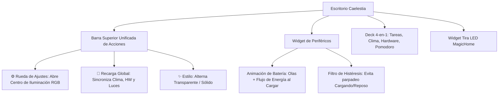
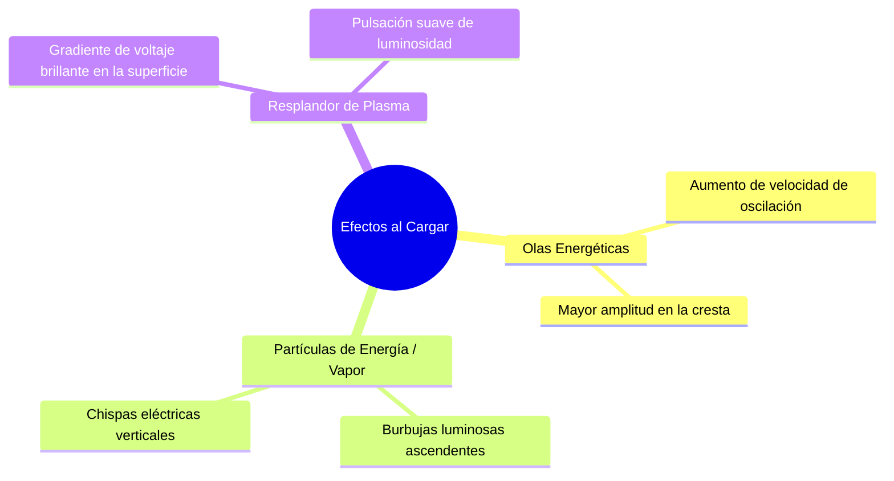

# 🎨 Rediseño de Widgets de Escritorio, Barra de Herramientas y Flujo de Energía

Documento maestro de diseño y especificaciones para la próxima iteración del escritorio: rediseño de cabecera de widgets, estabilización del estado de carga del ratón y animación de flujo de energía/vapor.

---

## 🎛️ 1. Rediseño de la Cabecera de Widgets (Toolbar Unificada)

### Problema Actual:
- El nuevo **Centro de Iluminación RGB** creado por Claude se abría al hacer clic sobre el ratón K7 Ultra, lo cual no es intuitivo.
- Los botones de recarga y transparencia estaban dispersos en el widget del reloj.

### Nueva Estructura Propuesta:
En la esquina superior derecha del bloque de widgets (o en la cabecera principal), colocar una botonera fija y elegante con 3 píldoras circulares:

| Botón | Icono | Acción |
|---|:---:|---|
| **Centro de Control** | `settings` / `tune` / `palette` | Abre el **Centro de Iluminación RGB y Ajustes** (`ShellState.rgbControl?.open()`). |
| **Recarga Global** | `sync` / `refresh` | Refresca el estado de las baterías, clima, telemetría de hardware y re-sincroniza las luces. |
| **Estilo Visual** | `blur_on` / `blur_off` | Alterna entre fondo translúcido y fondo sólido (guardado en `widgets-config.json`). |

*Resultado:* Las tarjetas de los dispositivos (**V9 Pro**, **K7 Ultra**, **Akko**) quedan limpias, mostrando su nivel de fluido y estado sin botones de ajuste confusos en su interior.

---

## 🔋 2. Diagnóstico del Estado de Carga del Ratón ("Cargando" ↔ "En Reposo")

### ¿Por qué parpadea el estado?
1. **Comportamiento Físico del Dock de Carga:**
   - Cuando el ratón llega al 90-100% de batería, el circuito entra en modo **carga por goteo (*trickle charge*)**.
   - En este modo, el hardware desconecta y conecta la corriente intermitentemente para proteger la salud de la celda de litio.
2. **Lectura Instantánea sin Filtro:**
   - El script `mchose-battery` lee el byte en crudo cada ciclo. Si en un ciclo no hay flujo de corriente, reporta "En reposo" y al siguiente ciclo "Cargando".

### Solución: Filtro de Histéresis y Debounce en `mchose-battery`:
- Implementar una ventana de confirmación en la máquina de estados:
  - Para pasar de **Cargando ➔ En Reposo**: se requieren **3 lecturas consecutivas (15 segundos)** sin corriente.
  - Para pasar de **En Reposo ➔ Cargando**: 1 sola lectura es suficiente (reacción instantánea al apoyar el ratón).

---

## ⚡ 3. Animación de "Flujo de Energía / Vapor / Rayos" al Cargar

Para llevar el efecto del líquido de la batería al siguiente nivel cuando un dispositivo esté conectado a la corriente:

### Especificación Visual del Efecto:
1. **Partículas Ascendentes (*Energy Bubbles / Sparks*):**
   - Pequeños círculos/destellos translúcidos generados en el fondo del líquido que suben flotando hacia la superficie y desaparecen al llegar a la cresta de la ola.
2. **Superficie de Plasma Brillante:**
   - La cresta superior de la ola líquida adquiere un resplandor más intenso con gradiente de color de voltaje (`Colours.palette.m3primary`).
3. **Pulsación de Frecuencia:**
   - La velocidad de la animación se incrementa un 40% simulando el flujo activo de corriente eléctrica dentro de la cápsula.

---

## 💡 4. Alineación y Widget de la Tira LED

- Asegurar que el contenedor `DesktopLedStrip` cuente con dimensiones fijas y anclajes limpios debajo de `DesktopWidgetDeck`.
- Garantizar que ningún elemento expandible altere la posición de los widgets adyacentes.
