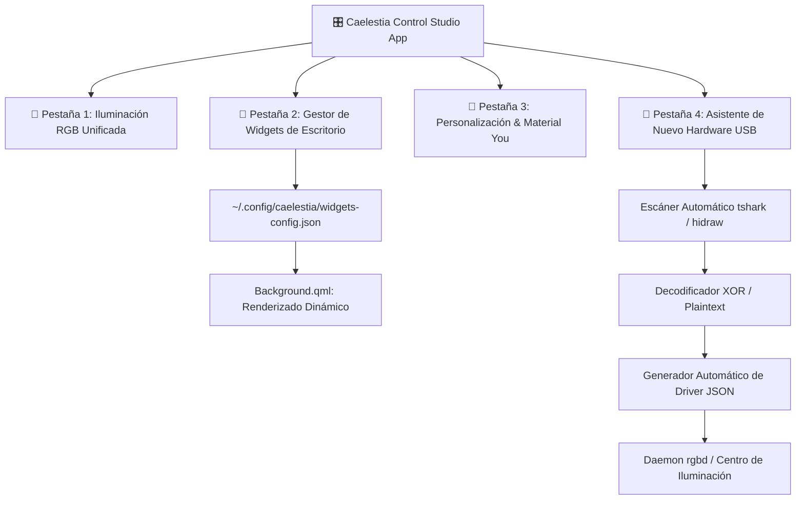
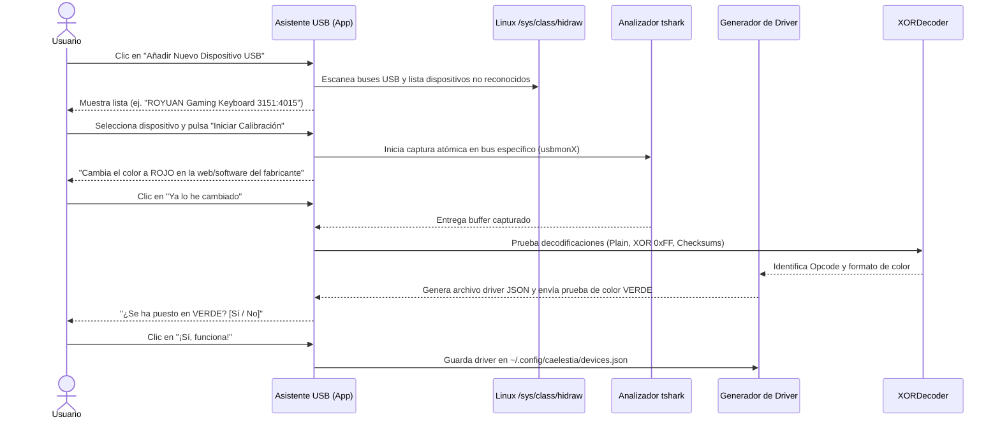

# 🎛️ Suite de Control · Centro de Widgets, RGB y Laboratorio USB

Visión y arquitectura para evolucionar el Centro de Control hacia una **Suite de Personalización Completa y Escalable** (*Caelestia Control Studio*), permitiendo gestionar widgets de escritorio, iluminación y añadir nuevo hardware mediante un asistente guiado de ingeniería inversa.



---

## 🧩 1. Gestor de Widgets de Escritorio (Modular & Desacoplado)

En lugar de tener widgets codificados de forma fija (*hardcoded*) en `Background.qml`, la suite permitirá a cualquier usuario activar, desactivar y personalizar sus widgets mediante una interfaz visual:

### 🎛️ Opciones en la Pestaña de Widgets:
1. **Interruptores de Activación (On/Off):**
   - `[✓]` **Reloj & Fecha Digital** *(Con selector de tamaño y alineación)*.
   - `[✓]` **Widget de Periféricos** *(Auriculares, Ratón, Teclado)*.
   - `[✓]` **Deck 4-en-1** *(Google Tasks, Clima, Telemetría HW, Pomodoro)*.
   - `[✓]` **Tira LED Ambiente** *(Magic Home Wi-Fi)*.
   - `[✓]` **Visualizador Orbital CAVA & Letras de Música**.
2. **Personalización del Reproductor de Música:**
   - Estilo: *Miniatura compacta* / *Vinilo giratorio* / *Carátula grande con letras sincronizadas*.
3. **Reordenación y Posicionamiento:**
   - Cambiar el orden vertical de los bloques o ajustar la transparencia del fondo (`blur`/`transparency`).

---

## 🧪 2. Asistente de Nuevo Hardware (*USB Reverse-Engineering Wizard*)

Una de las características más innovadoras: **un asistente paso a paso para que cualquier usuario pueda conectar un teclado, ratón o tira nueva que no soporte OpenRGB y hacerle ingeniería inversa con 3 clics**.



### 📋 ¿Cómo funciona el algoritmo del Asistente?
1. **Detección Automática:** Lee `lsusb` y mapea los nodos `/dev/hidraw*` del nuevo dispositivo.
2. **Captura Guiada:** Activa `tshark` durante 5 segundos mientras el usuario cambia un color conocido (ej. Rojo `#FF0000`).
3. **Detección de Patrón Criptográfico:**
   - Comprueba si el payload contiene `[255, 0, 0]` directo o invertido `[0, 255, 255]` (`XOR 0xFF`).
   - Detecta la longitud del reporte (21 bytes Feature Report, 64 bytes Interrupt Report).
   - Extrae el código de comando (Opcode).
4. **Prueba Inmediata:** Inyecta un color de prueba (ej. Cyan `#00E5FF`). Si el usuario confirma, el dispositivo queda añadido al ecosistema **para siempre**.

---

## 🚀 3. Estrategia de Escalabilidad: De Script a Aplicación Independiente

Para que este setup sea fácilmente instalable por cualquier persona de la comunidad:

### A. Capa de Aplicación Escritorio (`caelestia-studio.desktop`)
- Se empaqueta con un archivo `.desktop` estándar en `/usr/share/applications/` o `~/.local/share/applications/`.
- Permite abrirse desde el lanzador de aplicaciones (`Super + Space`), desde un icono en la barra o con el atajo global `Super + Shift + C`.

### B. Tecnologías de Interfaz Recomendadas:
1. **Opción A (Quickshell QML App - Recomendada):**
   - Máxima integración estética con el resto de Caelestia.
   - Rendimiento nativo C++ y fluidez total con animaciones Material You.
2. **Opción B (PySide6 / Qt6 Python):**
   - Gran portabilidad para distribuciones que no usen Caelestia (Fedora, Ubuntu, NixOS).
3. **Opción C (Tauri / Rust):**
   - Binario único compilado de menos de 10 MB con interfaz web moderna.

---

## 📁 4. Archivos de Configuración Desacoplados

```text
~/.config/caelestia/
├── rgb-config.json         # Configuración de luces y efectos
├── widgets-config.json     # Configuración de visibilidad y estilos de widgets
└── custom-devices/         # Plugins JSON de dispositivos generados por el Wizard
    ├── akko-5075b.json
    └── mchose-8k-base.json
```
