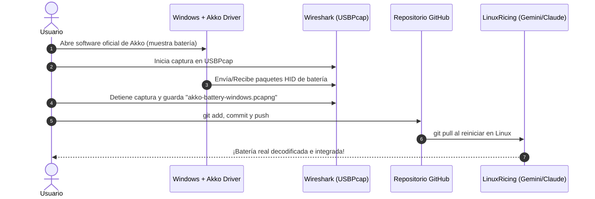

# 🪟 Guía Paso a Paso: Captura USB en Windows y Sincronización

Esta guía está diseñada para que puedas hacer la captura del tráfico USB de tus periféricos (**Teclado Akko 5075B Plus**, **Base MCHOSE 8K**, etc.) en Windows usando el software oficial del fabricante y subirla a GitHub para que Gemini y Claude la analicen al volver a Linux.



---

## 🛠️ Paso 1: Clonar el Repositorio y Abrir Obsidian en Windows

1. Abre **PowerShell** o **Git Bash** en Windows.
2. Clona tu repositorio (si no lo tienes ya):
   ```powershell
   git clone https://github.com/Alberviz/LinuxRicing.git
   cd LinuxRicing
   ```
3. Si ya lo tenías clonado, actualízalo con:
   ```powershell
   git pull origin main
   ```
4. Abre **Obsidian** en Windows:
   - Haz clic en **"Open folder as vault"** *(Abrir carpeta como bóveda)*.
   - Selecciona la carpeta `LinuxRicing\vault`.

---

## 🦈 Paso 2: Instalar Wireshark con USBPcap

1. Descarga e instala **[Wireshark para Windows](https://www.wireshark.org/download.html)**.
2. ⚠️ **MUY IMPORTANTE durante el instalador:**
   - Cuando te pregunte por componentes adicionales, **marca la casilla `Install USBPcap`**.
   - Si te pide reiniciar el ordenador para cargar el controlador USBPcap, reinicia.

---

## 📡 Paso 3: Realizar la Captura del Teclado Akko

1. Conecta tu teclado **Akko 5075B Plus** por cable USB o con su receptor 2.4G.
2. Abre **Wireshark**:
   - En la lista de interfaces de red verás varias llamadas **`USBPcap1`**, **`USBPcap2`**, etc.
   - Haz doble clic en la primera (normalmente `USBPcap1` o `USBPcap2`).
3. **Inicia la captura** y abre el software oficial de **Akko Cloud Driver / Akko Driver**:
   - Deja que el programa detecte el teclado y muestre el porcentaje de batería en pantalla.
   - Si quieres asegurar, cambia algún efecto o consulta la batería dentro del programa de Akko.
4. En Wireshark, pulsa el botón rojo cuadrado de **Detener Captura** (`Ctrl + E`).
5. Ve a **File** → **Save As...** *(Guardar como)*:
   - Guarda el archivo directamente dentro de tu carpeta `LinuxRicing` con el nombre:
   - 👉 `akko-battery-windows.pcapng`

---

## 🚀 Paso 4: Subir la Captura a GitHub

Abre tu terminal en Windows dentro de la carpeta `LinuxRicing` y ejecuta:

```powershell
git add akko-battery-windows.pcapng
git commit -m "feat: add Windows pcapng capture for Akko 5075B battery"
git push
```

---

## 🐧 Paso 5: Al volver a Linux

Cuando reinicies en Linux:
1. Abre tu terminal y haz:
   ```bash
   cd ~/LinuxRicing && git pull
   ```
2. Escríbeme: *"Gemini, ya he subido la captura de Windows"* y nosotros nos encargamos de extraer el byte exacto y dejar tu widget de batería funcionando con datos 100% reales.
