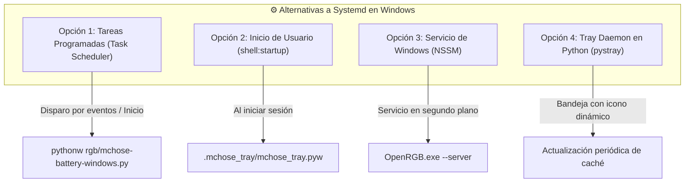

# 🛠️ Windows · Problemas, Limitaciones y Soluciones Técnicas

Este documento reúne las dificultades técnicas, limitaciones del sistema operativo Windows y las soluciones arquitectónicas implementadas para lograr paridad con el setup de Linux.

---

## 🛑 1. Bloqueo de Dispositivos HID (*Exclusive Access*) vs `hidraw` de Linux

### El Problema:
- En **Linux**, `/dev/hidraw*` permite abrir múltiples descriptores de archivo en modo no bloqueante sin interferir entre procesos a menos que se use `ioctl(HIDIOCGRDESC)`.
- En **Windows**, la API Win32 `CreateFile` con acceso `GENERIC_WRITE` puede devolver `Access Denied` si un software oficial (como Akko Cloud Driver o MCHOSE HUB) mantiene el identificador del dispositivo abierto sin los flags `FILE_SHARE_READ | FILE_SHARE_WRITE`.

### La Solución Implementada:
1. **Apertura efímera de descriptores:** En [`sync-rgb-windows.py`](file:///C:/Users/Alberviz/LinuxRicing/rgb/sync-rgb-windows.py) y [`mchose-battery-windows.py`](file:///C:/Users/Alberviz/LinuxRicing/rgb/mchose-battery-windows.py), los descriptores se abren, envían el reporte y se cierran inmediatamente (`dev.close()`) en menos de 5ms.
2. **Selección precisa de la interfaz Vendor:** Para la base MCHOSE y el teclado Akko, se filtra estrictamente por la interfaz de control (`MI_02`) y sus Usage Pages específicas (`0xFF01`, `0xFFA0`), evitando tocar las interfaces de teclado y ratón estándar del sistema operativo (`MI_00`, `MI_01`).
3. **Puente gRPC de Respaldo para Akko:** Si el driver oficial de Akko bloquea el acceso exclusivo por HID, el script conmuta automáticamente a la API interna gRPC (`http://127.0.0.1:3814/driver.DriverGrpc/sendMsg`), garantizando que la sincronización nunca falle.

---

## 🔄 2. Dual PID de Periféricos Inalámbricos (Modo 2.4G vs Cable USB)

### El Problema:
El microcontrolador ROYUAN del teclado Akko 5075B Plus utiliza identificadores de producto (PID) diferentes según el modo de conexión física:
- **Modo Inalámbrico 2.4G (Dongle):** `VID: 0x3151, PID: 0x4011`
- **Modo Cable USB Directo:** `VID: 0x3151, PID: 0x4015`

Si el script busca únicamente `0x4015`, la sincronización falla silenciosamente cuando el teclado se utiliza de forma inalámbrica.

### La Solución Implementada:
En la función `sync_akko_keyboard()`, se itera dinámicamente sobre la lista de PIDs soportados:

```python
for target_pid in [0x4011, 0x4015]:
    for d in hid.enumerate(0x3151, target_pid):
        if d.get('interface_number') == 2 or '&mi_02' in str(d.get('path', '')).lower():
            # Envío de Feature Report
```

---

## ⏱️ 3. Ausencia de `systemd --user` en Windows (Gestión de Servicios)

### El Problema:
En Linux, la telemetría periódica de batería y el servidor OpenRGB se gestionan mediante timers y servicios de usuario de Systemd (`mchose-battery.timer`, `openrgb.service`). En Windows no existe Systemd.

### Las Soluciones Técnicas:



1. **Servidor OpenRGB en Windows:** Se puede iniciar automáticamente con el parámetro `--server` minimizado en la bandeja del sistema o como servicio con **NSSM**.
2. **Monitor de Batería:** Se ejecuta a través de [`mchose_tray.pyw`](file:///C:/Users/Alberviz/.mchose_tray/mchose_tray.pyw) en la carpeta de inicio (`shell:startup`) o mediante consultas periódicas de la barra **YASB** cada 30 segundos (`yasb_mchose.py`).
3. **Caché centralizada:** Los datos de batería se guardan en `%LOCALAPPDATA%\LinuxRicing\mchose_battery.json` para que cualquier widget o script pueda leerlos instantáneamente sin realizar consultas continuas por USB.

---

## 🌙 4. Restauración tras Suspensión / Reanudación (*Sleep / Resume*)

### El Problema:
Al suspender el PC o reanudarlo tras un periodo de inactividad, los dongles inalámbricos USB y las controladoras RGB de la placa y la RAM se reinician a su modo por defecto por hardware (ciclo *Rainbow* o color de fábrica).

### La Solución:
Configurar una **Tarea Programada de Windows (Task Scheduler)** con disparador por evento de registro:
- **Registro:** `System`
- **Origen:** `Power-Troubleshooter` o `Kernel-Power`
- **Identificador de Evento (Event ID):** `1` (Reanudación del sistema tras suspensión).
- **Acción:** `python.exe C:\Users\Alberviz\LinuxRicing\rgb\sync-rgb-windows.py`

De este modo, tan pronto como el equipo se despierta, toda la iluminación de la mesa, teclado, ratón, ventiladores y RAM recupera al instante la paleta armónica del fondo de pantalla.
