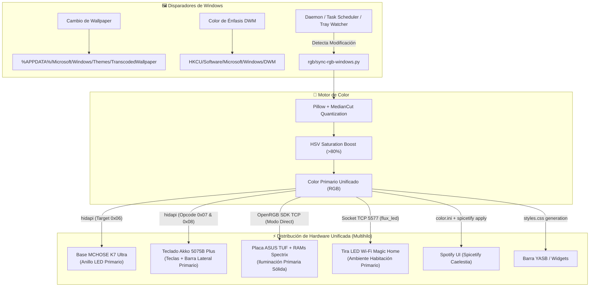

# 🪟 Windows · Arquitectura y Sincronización del Ecosistema

Este documento detalla la arquitectura completa de sincronización y personalización en **Windows 11 (Dual-Boot con Arch Linux / Hyprland)**, explicando cómo replicar la reactividad cromática de Material You, el control de periféricos y los widgets de escritorio.

---

## 🏛️ 1. Diagrama de Flujo de Sincronización en Windows

En Linux, la sincronización se dispara a través del `postHook` de Caelestia y Matugen. En Windows, la arquitectura funciona de forma autónoma mediante extracción de color de la imagen activa del wallpaper y distribución multihilo:

---

## 🎨 2. Extracción de Color vs Matugen en Linux

| Característica | Linux (Caelestia / Hyprland) | Windows 11 (Dual-Boot) |
|---|---|---|
| **Motor de Extracción** | `matugen image <wallpaper>` | `PIL.Image.quantize(MEDIANCUT)` + filtro HSV con umbral de pureza en `sync-rgb-windows.py` |
| **Fuente del Fondo** | Ruta del archivo configurada en Caelestia | `%APPDATA%\Microsoft\Windows\Themes\TranscodedWallpaper` |
| **Almacenamiento de Paleta** | `~/.local/state/caelestia/scheme.json` | Memoria en ejecución / `%LOCALAPPDATA%\LinuxRicing\scheme.json` |
| **Disparador** | Evento `postHook` en `cli.json` de Caelestia | File Watcher sobre `TranscodedWallpaper` / Tarea Programada / Atajo |
| **Color Aplicado** | M3 Primary unificado a todo el hardware | Color Primario saturado unificado a todos los dispositivos |

---

## ⚙️ 3. Componentes Activos en Windows

1. **`rgb/sync-rgb-windows.py`**:
   - Sincronizador maestro multihilo (`threading.Thread`).
   - Controla OpenRGB, MCHOSE Base, Teclado Akko (detectando automáticamente conexión inalámbrica 2.4G en PID `0x4011` y cable USB en PID `0x4015`), y tira LED Magic Home por Wi-Fi.
2. **`rgb/mchose-battery-windows.py`**:
   - CLI y proveedor de datos JSON (`--json`) para telemetría de periféricos.
   - Lee auriculares MCHOSE V9 Pro, ratón MCHOSE K7 Ultra y estado del teclado Akko en <50ms.
3. **Barra de Estado YASB (`C:\Users\Alberviz\.config\yasb\`)**:
   - Barra superior moderna con widget de batería de periféricos (`yasb_mchose.py`), reloj, workspaces y controles multimedia.
4. **Daemon de Bandeja del Sistema (`C:\Users\Alberviz\.mchose_tray\mchose_tray.pyw`)**:
   - Monitor de bandeja (*system tray*) con icono dinámico de batería.

---

## 🔗 4. Sincronización de Archivos y Repositorio

- Repositorio principal: `C:\Users\Alberviz\LinuxRicing`
- Histórico anterior: `C:\Users\Alberviz\LinuxRicingWindows` (los componentes han sido refactorizados y consolidados en el repo maestro).
