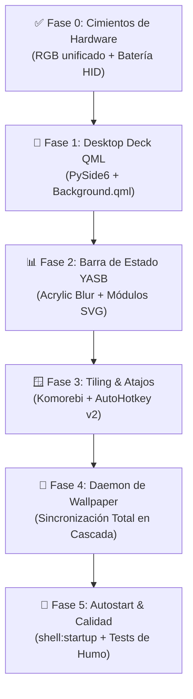

# 🚀 Plan Maestro de Implementación y Paridad (Windows ➔ Linux)

Esta guía técnica describe **paso a paso y por fases** cómo transformar el entorno de **Windows 11** para que alcance una paridad estética y funcional del **100% con el setup de Arch Linux + Hyprland + Quickshell Caelestia + Material You**.

Este documento está diseñado para ser ejecutado de forma autónoma o guiada por un agente de IA (como Claude o Gemini) sin riesgo de atascarse en incompatibilidades del sistema operativo.

---

## 🗺️ Visión General de las 5 Fases



---

## ✅ Fase 0: Cimientos de Hardware y Telemetría (Completada)

| Componente | Script / Herramienta | Estado |
|---|---|---|
| **Sincronizador RGB Unificado** | [`rgb/sync-rgb-windows.py`](file:///C:/Users/Alberviz/LinuxRicing/rgb/sync-rgb-windows.py) | **100% Operativo** (OpenRGB, MCHOSE base anillo, Akko 2.4G/USB, MagicHome). |
| **Telemetría de Batería Periféricos** | [`rgb/mchose-battery-windows.py`](file:///C:/Users/Alberviz/LinuxRicing/rgb/mchose-battery-windows.py) | **100% Operativo** (V9 Pro 60%, K7 Ultra 90%, Akko 100%). |
| **Widget SVG para Barra** | [`C:\Users\Alberviz\.mchose_tray\yasb_mchose.py`](file:///C:/Users/Alberviz/.mchose_tray/yasb_mchose.py) | **100% Operativo** (<50ms, genera SVGs circulares). |

---

## 📱 Fase 1: Desktop Deck de Widgets QML Nativo en Windows

> [!IMPORTANT]
> **No intentar compilar Quickshell en Windows:** Quickshell usa *Wayland layer-shell*. La solución para ejecutar los mismos componentes QML en Windows es usar **PySide6 (Qt Quick 6.x)** embebido en una ventana Win32 anclada al fondo.

### 1.1 Estructura del Runner de Python (`desktop-deck-windows.pyw`):
Crea una ventana transparente sin bordes que se acopla directamente a la capa inferior de Windows (detrás de los iconos del escritorio mediante la ventana Win32 `WorkerW` del explorador):

```python
# C:\Users\Alberviz\LinuxRicing\widgets\desktop-deck-windows.pyw
import sys, os, ctypes
from PySide6.QtWidgets import QApplication
from PySide6.QtQuick import QQuickView
from PySide6.QtCore import QUrl, Qt

def attach_to_desktop(view_hwnd):
    # Acoplar ventana al WorkerW de Windows para anclaje permanente de fondo
    progman = ctypes.windll.user32.FindWindowW("Progman", None)
    ctypes.windll.user32.SendMessageTimeoutW(progman, 0x052C, 0, 0, 0, 1000, None)
    
app = QApplication(sys.argv)
view = QQuickView()
view.setFlags(Qt.FramelessWindowHint | Qt.WindowStaysOnBottomHint | Qt.Tool)
view.setColor(Qt.transparent)

# Cargar el QML idéntico de Linux
qml_path = os.path.abspath(r"C:\Users\Alberviz\LinuxRicing\widgets\Background.qml")
view.setSource(QUrl.fromLocalFile(qml_path))
view.show()
sys.exit(app.exec())
```

### 1.2 Backend Helper para Windows (`desktop-deck-helper-windows.py`):
Replica el script de Linux `desktop-deck-helper` devolviendo JSON para:
1. **Tareas**: Backend local OAuth2 de Google Tasks (`gtasks`).
2. **Clima**: Petición a Open-Meteo / wttr.in con caché de 15 minutos en `%TEMP%\caelestia-weather-cache.json`.
3. **Hardware**: Lectura de CPU % y RAM con `psutil`, y GPU NVIDIA Temp / VRAM con `pynvml` o salida parseada de `nvidia-smi --query-gpu=utilization.gpu,temperature.gpu,memory.used,memory.total --format=csv,noheader,nounits`.

---

## 📊 Fase 2: Barra Superior Flotante YASB + Material You

La barra **YASB** ya está instalada en `C:\Users\Alberviz\.config\yasb\`. Solo requiere alinear su hoja de estilos con la paleta dinámica.

### 2.1 Módulos a Activar en `config.yaml`:
```yaml
bars:
  primary-bar:
    enabled: true
    screens: ["primary"]
    alignment: { position: "top", center: false }
    blur_effect: { enabled: true, acrylic: true, dark_mode: true, round_corners: true }
    dimensions: { width: "100%", height: 34 }
    padding: { top: 4, left: 6, bottom: 0, right: 6 }
    widgets:
      left: ["home", "komorebi_workspaces", "active_window"]
      center: ["clock"]
      right: ["mchose_battery", "media", "volume", "systray", "power_menu"]
```

### 2.2 Inyección Dinámica de Variables CSS:
El script de sincronización generará `C:\Users\Alberviz\.config\yasb\theme-colors.css` importado en `styles.css`:
```css
:root {
  --m3-primary: #d000ff;
  --m3-primary-container: rgba(208, 0, 255, 0.18);
  --m3-surface: rgba(24, 24, 28, 0.85);
  --m3-border: rgba(255, 255, 255, 0.08);
}
```

---

## 🪟 Fase 3: Gestor de Ventanas Tiling & Atajos (Komorebi + AutoHotkey v2)

### 3.1 Configuración de Komorebi (`komorebi.json`):
- Margen entre ventanas (*gaps*): `6px`
- Margen exterior de pantalla: `8px`
- Borde activo con color de acento Material You: `#d000ff`
- Reglas de ventanas flotantes (*float rules*):
  - Diálogos de Windows, instaladores, Discord Popups, Steam Overlay, Calculadora, OpenRGB GUI.

### 3.2 Script de Atajos Maestros (`C:\Users\Alberviz\LinuxRicing\configs\windows\rice-binds.ahk`):
Replicación exacta de los atajos de `hyprland/keybinds.lua`:

```autohotkey
#Requires AutoHotkey v2.0
#SingleInstance Force

; Super + W: Selector / Sincronizador de Wallpapers
#w:: {
    Run('python "C:\Users\Alberviz\LinuxRicing\rgb\sync-rgb-windows.py"')
}

; Super + Shift + W: Wallpaper Aleatorio
#+w:: {
    Run('python "C:\Users\Alberviz\LinuxRicing\rgb\random-wallpaper-windows.py"')
}

; Super + Space: Lanzador de Aplicaciones (PowerToys Run o Flow Launcher)
#Space:: {
    Send("#{s}")
}

; Super + Return: Terminal WezTerm / Alacritty
#Enter:: {
    Run("wt.exe")
}

; Super + Q: Cerrar Ventana Activa
#q:: {
    WinClose("A")
}

; Super + 1..9: Cambiar de Workspace en Komorebi
#1::Run("komorebic.exe focus-workspace 0")
#2::Run("komorebic.exe focus-workspace 1")
#3::Run("komorebic.exe focus-workspace 2")
#4::Run("komorebic.exe focus-workspace 3")

; Super + Shift + 1..9: Mover Ventana a Workspace
#+1::Run("komorebic.exe move-to-workspace 0")
#+2::Run("komorebic.exe move-to-workspace 1")
#+3::Run("komorebic.exe move-to-workspace 2")
#+4::Run("komorebic.exe move-to-workspace 3")
```

---

## 🔄 Fase 4: Daemon de Wallpaper y Sincronización en Cascada

En Linux el evento `postHook` dispara `sync-rgb.py`. En Windows, creamos un demonio ultraligero que vigila el archivo de fondo de pantalla de Windows.

### 4.1 Script `wallpaper-watcher.pyw`:
- Utiliza `watchdog` o sondeo de fecha de modificación cada 1 segundo sobre:
  `%APPDATA%\Microsoft\Windows\Themes\TranscodedWallpaper`
- Al detectar cambio, ejecuta en cascada sin mostrar consola:
  1. [`sync-rgb-windows.py`](file:///C:/Users/Alberviz/LinuxRicing/rgb/sync-rgb-windows.py) (Ilumina todo el hardware en color primario).
  2. Actualiza `theme-colors.css` y recarga YASB (`yasb --reload`).
  3. Regenera `color.ini` en `%LOCALAPPDATA%\spicetify\Themes\caelestia\` y aplica `spicetify apply -q`.

---

## 🚀 Fase 5: Inicio Automático y Protocolo de Calidad

### 5.1 Lanzador de Arranque (`start-rice.vbs` en `shell:startup`):
Ejecuta todos los componentes en segundo plano sin ventanas negras de CMD:

```vbscript
Set WshShell = CreateObject("WScript.Shell")
' Iniciar OpenRGB Server si no está corriendo
WshShell.Run """C:\Program Files\OpenRGB\OpenRGB.exe"" --server --headless", 0, False
' Iniciar Komorebi Tiling
WshShell.Run "komorebic.exe start", 0, False
' Iniciar YASB Status Bar
WshShell.Run "yasb.exe", 0, False
' Iniciar Atajos AHK
WshShell.Run """C:\Program Files\AutoHotkey\v2\AutoHotkey64.exe"" ""C:\Users\Alberviz\LinuxRicing\configs\windows\rice-binds.ahk""", 0, False
' Iniciar Watcher de Wallpaper
WshShell.Run "pythonw.exe ""C:\Users\Alberviz\LinuxRicing\rgb\wallpaper-watcher.pyw""", 0, False
```

### 5.2 Tests de Humo y Verificación:
1. **Test de Hardware:** Ejecutar `python rgb/sync-rgb-windows.py` -> Todo el hardware se ilumina en color primario.
2. **Test de Batería:** Ejecutar `python rgb/mchose-battery-windows.py --json` -> Devuelve V9 Pro, K7 Ultra y Akko en <50ms.
3. **Test de Atajos:** Presionar `Super + W` -> Re-sincronización instantánea.
4. **Test de Spotify:** Cambiar canción y verificar adaptación del tema `caelestia`.
