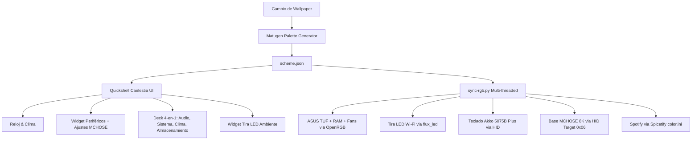

# Arquitectura General del Setup · LinuxRicing

Vista panorámica de la infraestructura del sistema (Arch / CachyOS + Hyprland + Quickshell Caelestia + Material You).

---

## 1. Componentes Principales

| Componente | Rol | Tecnologías |
|---|---|---|
| **Hyprland** | Compositor Wayland dinámico | C++, Lua (`hyprland.lua`), IPC socket |
| **Quickshell Caelestia** | Entorno de escritorio (Barra, Widgets, OSD, Dashboard) | QML, Qt Quick, JavaScript, Wayland Layer Shell |
| **Matugen** | Extracción dinámica de paletas Material You a partir de fondos | Rust, JSON (`~/.local/state/caelestia/scheme.json`) |
| **Spicetify** | Sincronización cromática en tiempo real de Spotify | CLI `spicetify apply`, temas CSS / `color.ini` |
| **OpenRGB** | Control de placa base ASUS TUF B560M-PLUS y RAM ENE DRAM | OpenRGB SDK (`localhost:6742`), SMBus / I2C |
| **MCHOSE Driver** | Telemetría de batería y control de iluminación HID | Python, `ioctl`, `hidraw`, XOR 0xFF |

---

## 2. Atajos Clave de Hyprland

- **`Super + W`**: Despliega el lanzador centrado prefiltrado en `>wallpaper ` con el **carrusel horizontal de fondos con miniaturas interactivas**.
- **`Super + Shift + W`**: Cambia a un fondo aleatorio instantáneamente.
- **`Super + Space`**: Lanzador de aplicaciones Caelestia.
- **`Super + Tab`**: Dashboard y centro de control.

---

## 3. Sincronización de Archivos (Repo ↔ Sistema)

| Ámbito | Ruta Activa en el Sistema | Ruta en Git (`~/LinuxRicing/`) |
|---|---|---|
| **Quickshell Caelestia** | `~/.config/quickshell/caelestia/` | `configs/quickshell/caelestia/` |
| **Widgets de Escritorio** | `~/.config/quickshell/.../Background.qml` | `widgets/Background.qml` |
| **Scripts RGB** | `~/.local/bin/mchose-*`, `magichome-control` | `rgb/` |
| **Sincronizador Global** | `~/.config/caelestia/sync-rgb.py` | `rgb/sync-rgb.py` |
| **Bóveda Obsidian** | `~/LinuxRicing/vault/` | `vault/` |
