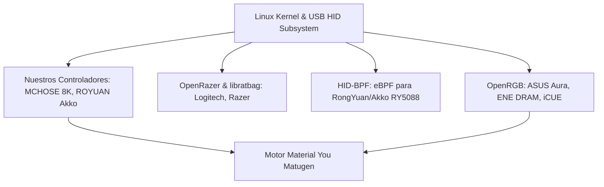

# 🌐 Estado del Arte · Ingeniería Inversa y Control RGB en Linux

Investigación exhaustiva sobre cómo la comunidad de código abierto y desarrolladores de todo el mundo integran hardware propietario en Linux, y cómo se posiciona nuestro setup frente a los estándares de la industria.



---

## 🔬 1. ¿Cómo maneja la comunidad los periféricos "Gaming" en Linux?

En Linux no existen las suites propietarias de Windows (iCUE, Razer Synapse, Armoury Crate, MCHOSE Hub). La comunidad ha creado tres grandes pilares:

### A. OpenRGB (El Estándar Universal)
- **Alcance:** Controla placas base, memorias RAM, GPUs, tiras LED direccionables y periféricos de más de 50 marcas.
- **Cómo lo hace:** Ingeniería inversa de protocolos SMBus / I2C y paquetes USB mediante Wireshark.
- **Nuestra integración:** Usamos el SDK TCP nativo de OpenRGB en `localhost:6742` para cambiar la placa **ASUS TUF B560M** y las memorias **ENE DRAM** en milisegundos con cero sobrecarga.

### B. Proyectos de MCUs Chinos (ROYUAN, RongYuan RY5088, Sinowealth)
Marcas como **Akko, MonsGeek, Epomaker, Yunzii y Attack Shark** utilizan chips OEM de fabricantes como *RongYuan* (identificadores `VID: 3151` o `VID: 0c45`).
- **En la comunidad:** Se han desarrollado proyectos pioneros como [`akko-bpf-battery`](https://github.com/echtzeit/akko-bpf-battery), que utilizan la tecnología moderna **HID-BPF** (introducida en los kernels Linux 6.12+) para inyectar programas eBPF que interceptan los paquetes del teclado y exponen la batería nativamente a `/sys/class/power_supply/`.
- **En nuestro setup:** Nuestro teclado **Akko 5075B Plus (`3151:4015`)** está en `Bus 001` (`/dev/hidraw0..2`), listo para que descifremos su Feature Report de batería real.

---

## 🐭 2. El Misterio del "ARGB" en la Base MCHOSE 8K: ¿Por qué nadie tiene un lienzo por LED?

Muchos usuarios se preguntan: *¿Si la base tiene una tira de LEDs direccionables que hace un arcoíris en movimiento, por qué no podemos pintar el LED 1 de azul y el LED 5 de naranja desde el ordenador?*

### La Explicación de Ingeniería de Hardware:
1. **Prioridad del Dongle 8K (Tasa de Sondeo de 8000 Hz):**
   - El chip del receptor inalámbrico procesa el sensor del ratón a **8000 reportes por segundo (0.125 ms de latencia)**.
   - Si el microcontrolador tuviera que recibir y renderizar por USB un flujo continuo de 30 o 60 FPS de colores LED individuales enviados desde el PC, la cola del búfer saturaría el microcontrolador y provocaría micro-tirones (*jitter*) en el movimiento del ratón mientras juegas.
2. **Algoritmos Quemados en ROM:**
   - Para evitar este cuello de botella, el fabricante programó el efecto de **Ola Arcoíris (`Target 0x07`) directamente en el código de la memoria ROM del chip**.
   - El PC solo envía un comando de 20 bytes una sola vez diciendo: *"actívate"*, y el chip calcula la rotación de colores internamente con cero consumo de CPU ni ancho de banda USB.
3. **Conclusión de la Comunidad:**
   - Ningún proyecto en GitHub ni SignalRGB cuenta con volcado de lienzo por LED para dongles de 8K de marcas como MCHOSE, VGN o Darmoshark sin sustituir el firmware original.
   - **Nuestra arquitectura híbrida** (usar `Target 0x06` para sincronización cromática perfecta con el escritorio Material You + `Target 0x07` para animación fluida de carga) es exactamente el estándar óptimo que utiliza la comunidad internacional.

---

## ⌨️ 3. Próximo Paso: Telemetría de Batería Real del Teclado Akko (`3151:4015`)

Para atrapar el porcentaje de batería real del teclado Akko:
1. El teclado está localizado en el **Bus USB 1** (`Bus 001 Device 002: ID 3151:4015`).
2. Utilizaremos el comando estándar oficial:
   ```bash
   sudo tshark -i usbmon1 -w /tmp/akko-battery.pcapng
   sudo chmod 666 /tmp/akko-battery.pcapng
   ```
3. Cuando estés listo, lanzaremos la captura, pulsaremos la combinación de consulta de batería del teclado (o abriremos el software de Akko) y extraeremos el byte exacto de porcentaje (0–100%) para integrarlo en el widget de periféricos.
