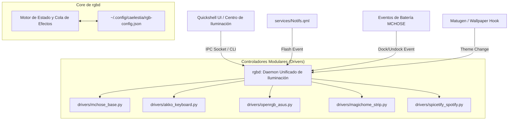

# 🏗️ Plan de Unificación y Modularización · Daemon `rgbd` & `rgbctl`

Propuesta de refactorización arquitectónica para resolver la fragmentación del ecosistema RGB y consolidar todos los scripts aislados en una **arquitectura modular de grado de producción**.



---

## 🛑 1. Diagnóstico del Estado Actual: ¿Por qué está "demasiado expandido"?

Actualmente, el sistema funciona pero está compuesto por múltiples piezas independientes que compiten entre sí:

| Script Actual | Rol | Problemas Identificados |
|---|---|---|
| **`sync-rgb.py`** | Sincronización masiva en paralelo | No guarda memoria del estado previo; no permite apagar dispositivos individuales; se ejecuta de cero cada vez. |
| **`mchose-battery`** | Daemon de telemetría + máquina de estados de luz | Abre `/dev/hidraw7` repetidamente; compite con `sync-rgb.py` por el bus USB; duplica lógica de cálculo de colores. |
| **`mchose-config`** | CLI de configuración | Solo gestiona `mchose-config.json` en lugar de una configuración RGB global de todo el setup. |
| **`mchose-lighting`** | CLI de efectos manuales | No notifica a otros daemons, por lo que `mchose-battery` o `sync-rgb` pueden pisar su efecto en el siguiente ciclo. |
| **`magichome-control`** | CLI Wi-Fi | Llamadas aisladas por subproceso sin cola ni debounce. |
| **`Background.qml`** | Widgets de escritorio | Está duplicado en `configs/quickshell/caelestia/...` y `widgets/Background.qml` obligando a editar doble. |

---

## 🎯 2. La Solución Unificada: Arquitectura `rgbd` + `rgbctl`

Proponemos fusionar toda la capa de backend en **un paquete modular limpio** en `~/LinuxRicing/rgbd/`:

### A. Estructura de Directorios Propuesta:
```text
~/LinuxRicing/rgbd/
├── rgbd.py                 # Daemon principal (servicio systemd o spawn por Caelestia)
├── rgbctl                  # CLI unificado para usuario, widgets y scripts
├── core/
│   ├── config.py           # Gestor de ~/.config/caelestia/rgb-config.json
│   ├── state_engine.py     # Gestor de estados, snapshots y cola de efectos reactivos
│   └── ipc_server.py       # Socket UNIX / JSON-RPC ultrarrápido (<2ms)
└── drivers/
    ├── base_driver.py      # Clase abstracta común
    ├── mchose.py           # Base 8K (Target 0x06, 0x02, 0x01, 0x07) y ratón
    ├── akko.py             # Teclado 5075B Plus (teclas + tira lateral)
    ├── openrgb.py          # ASUS TUF B560M + RAM ENE DRAM
    ├── magichome.py        # Tira LED Wi-Fi
    └── spicetify.py        # Spotify color.ini
```

---

## ⚙️ 3. Archivo de Configuración Unificado (`rgb-config.json`)

Reemplaza todos los JSONs fragmentados por una única fuente de verdad:

```json
{
  "general": {
    "mode": "theme",                // "theme" (Material You) o "fixed"
    "fixed_color": "#00e5ff",
    "master_power": true
  },
  "devices": {
    "mchose_base": {
      "enabled": true,
      "brightness": 100,
      "charging_effect": "theme_breathing",
      "low_battery_effect": "red_breathing",
      "low_battery_threshold": 20
    },
    "akko_keyboard": {
      "enabled": true,
      "keys_backlight": true,
      "side_strip": true,
      "brightness": 4
    },
    "asus_openrgb": {
      "enabled": true,
      "sync_motherboard": true,
      "sync_ram": true
    },
    "magichome_strip": {
      "enabled": true,
      "ip": "192.168.0.136"
    },
    "spicetify": {
      "enabled": true
    }
  },
  "reactive_effects": {
    "notification_flash": {
      "enabled": true,
      "mode": "complementary",       // "red", "accent", "complementary"
      "pulses": 2,
      "target_devices": ["mchose_base", "akko_keyboard", "magichome_strip"] // Excluye OpenRGB (SMBus lento)
    }
  }
}
```

---

## 🚀 4. Ventajas Inmediatas de esta Refactorización

1. **Cero Conflictos / Colisiones**:
   - `rgbd` es el único dueño de los descriptores HID (`/dev/hidraw`) y sockets de red.
2. **Motor de Efectos Temporales (*Snapshot & Restore*)**:
   - Cuando llega una notificación o una alerta: `rgbd` toma una foto instantánea del estado actual, ejecuta el flash en 500ms y restaura la iluminación previa con suavidad.
3. **Control Total en la Nueva Ventana de Claude**:
   - El nuevo Centro de Iluminación de Claude solo tiene que hablar con `rgbctl` o emitir un mensaje al socket para encender/apagar cualquier dispositivo individualmente o cambiar el modo en tiempo real.
4. **Instalador y Mantenimiento Limpios**:
   - Un solo paquete para instalar y desplegar en `install.sh`. Eliminación total de archivos duplicados.
